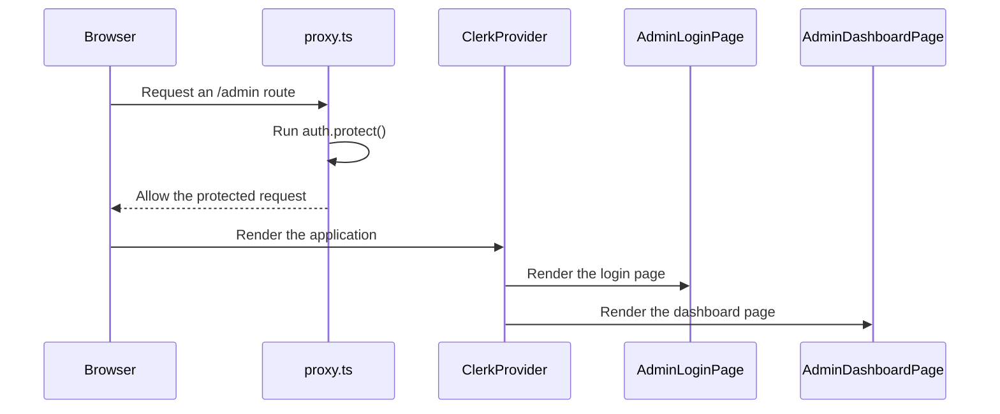

<!-- This is an auto-generated comment: summarize by coderabbit.ai -->
<!-- review_stack_entry_start -->

[](https://app.coderabbit.ai/change-stack/erfanansarioct10-oss/black-swa-v1/pull/8?utm_source=github_walkthrough&utm_medium=github&utm_campaign=change_stack)

<!-- review_stack_entry_end -->
<!-- walkthrough_start -->

<details>
<summary>📝 Walkthrough</summary>

## Walkthrough

The application now includes Clerk authentication, protected admin routes, a branded admin login page, and an admin dashboard. Project documentation now tracks Phase 3 quote-system work.

### Changes

**Admin portal**

| Layer / File(s)                                                                                  | Summary                                                                                                                                 |
| ------------------------------------------------------------------------------------------------ | --------------------------------------------------------------------------------------------------------------------------------------- |
| **Clerk provider and route protection** <br> `app/layout.tsx`, `proxy.ts`                        | `ClerkProvider` wraps the application. Clerk middleware protects `/admin` routes and defines the application matcher.                   |
| **Admin login and dashboard** <br> `app/admin/login/[[...login]]/page.tsx`, `app/admin/page.tsx` | The login page renders Clerk `SignIn` with portal branding. The dashboard adds metadata, `UserButton`, and RFQ and system-status cards. |
| **Quote-system planning** <br> `context/progress-tracker.md`, `docs/feature-roadmap.md`          | The project documents Phase 3A quote-system implementation and four planned quote-system workstreams.                                   |

**Estimated code review effort:** 3 (Moderate) | ~20 minutes

### Sequence Diagram(s)



**Possibly related PRs**

- [erfanansarioct10-oss/black-swa-v1#1](https://github.com/erfanansarioct10-oss/black-swa-v1/pull/1): Extends the same Next.js application and layout structure used by this admin portal.

</details>

<!-- walkthrough_end -->
<!-- pre_merge_checks_walkthrough_start -->

<details>
<summary>🚥 Pre-merge checks | ✅ 5</summary>

<details>
<summary>✅ Passed checks (5 passed)</summary>

|         Check name         | Status    | Explanation                                                                                                |
| :------------------------: | :-------- | :--------------------------------------------------------------------------------------------------------- |
|     Description Check      | ✅ Passed | Check skipped - CodeRabbit’s high-level summary is enabled.                                                |
|        Title check         | ✅ Passed | The title accurately summarizes the Clerk authentication setup and Phase 3 Quote System roadmap changes.   |
|     Docstring Coverage     | ✅ Passed | No functions found in the changed files to evaluate docstring coverage. Skipping docstring coverage check. |
|    Linked Issues check     | ✅ Passed | Check skipped because no linked issues were found for this pull request.                                   |
| Out of Scope Changes check | ✅ Passed | Check skipped because no linked issues were found for this pull request.                                   |

</details>

</details>

<!-- pre_merge_checks_walkthrough_end -->
<!-- finishing_touch_checkbox_start -->

<details>
<summary>✨ Finishing Touches</summary>

<details>
<summary>📝 Generate docstrings</summary>

- [ ] <!-- {"checkboxId": "7962f53c-55bc-4827-bfbf-6a18da830691"} --> Create stacked PR
- [ ] <!-- {"checkboxId": "3e1879ae-f29b-4d0d-8e06-d12b7ba33d98"} --> Commit on current branch

</details>
<details>
<summary>🧪 Generate unit tests (beta)</summary>

- [ ] <!-- {"checkboxId": "f47ac10b-58cc-4372-a567-0e02b2c3d479", "radioGroupId": "utg-output-choice-group-unknown_comment_id"} -->   Create PR with unit tests
- [ ] <!-- {"checkboxId": "6ba7b810-9dad-11d1-80b4-00c04fd430c8", "radioGroupId": "utg-output-choice-group-unknown_comment_id"} -->   Commit unit tests in branch `phase3`

</details>

</details>

<!-- finishing_touch_checkbox_end -->
<!-- tips_start -->

---

<sub>Comment `@coderabbitai help` to get the list of available commands.</sub>

<!-- tips_end -->

**Actionable comments posted: 5**

<details>
<summary>🧹 Nitpick comments (1)</summary><blockquote>

<details>
<summary>proxy.ts (1)</summary><blockquote>

`1-3`: _📐 Maintainability & Code Quality_ | _🔵 Trivial_ | _⚡ Quick win_

**Migrate away from deprecated `createRouteMatcher()`.**

The current Clerk Next.js SDK reference marks `createRouteMatcher()` as deprecated and recommends resource-based authorization checks. It also prefers the `:path*` form for subtree patterns. Replace this helper, or verify the installed `@clerk/nextjs` 7.6.2 behavior before adding more protected resources. ([clerk.com](https://clerk.com/docs/reference/nextjs/clerk-middleware))

<details>
<summary>🤖 Prompt for AI Agents</summary>

```
Verify each finding against current code. Fix only still-valid issues, skip the
rest with a brief reason, keep changes minimal, and validate.

In `@proxy.ts` around lines 1 - 3, Replace the deprecated createRouteMatcher usage
in the isAdminRoute definition with Clerk’s resource-based authorization
approach, using the supported /admin/:path* subtree pattern where applicable.
Verify compatibility with `@clerk/nextjs` 7.6.2 and update the surrounding
clerkMiddleware authorization flow to preserve admin-route protection.
```

</details>

<!-- cr-comment:v1:07c2b2f8c735ea1a3dae8f10 -->

</blockquote></details>

</blockquote></details>

<details>
<summary>🤖 Prompt for all review comments with AI agents</summary>

```
Verify each finding against current code. Fix only still-valid issues, skip the
rest with a brief reason, keep changes minimal, and validate.

Inline comments:
In `@app/admin/page.tsx`:
- Around line 44-49: Update the System Status card in the admin dashboard so it
no longer hard-codes “Operational” or “Clerk Auth & Supabase DB Linked”; until
real server-side health results are available, render “Pending” or “Unknown” for
the status and integration summary.

In `@context/progress-tracker.md`:
- Line 7: Update both links in progress-tracker.md, including the Phase 3 entry
and the other occurrence, to use the repository-relative target
../docs/feature-roadmap.md instead of the machine-specific file:// URL.
- Line 5: Update the “Current Phase” heading in progress-tracker.md from a
level-three heading to a level-two heading, keeping “Progress Tracker” as the
document’s sole level-one title.

In `@proxy.ts`:
- Around line 3-8: Update the admin route guard around isAdminRoute and
auth.protect() to exclude /admin/login and all of its subpaths from
authentication protection, while continuing to protect /admin and other admin
routes. Verify unauthenticated requests to /admin/login, /admin/login/foo, and
/admin do not redirect-loop and preserve the existing SignIn rendering path.
- Around line 5-8: Update the clerkMiddleware callback’s isAdminRoute branch to
enforce authorization for Managing Directors and Sales Engineering personnel,
not just authentication via auth.protect(). Use the project’s existing Clerk
permission, role, or allowlist mechanism, and ensure unauthorized users cannot
reach app/admin/page.tsx.

---

Nitpick comments:
In `@proxy.ts`:
- Around line 1-3: Replace the deprecated createRouteMatcher usage in the
isAdminRoute definition with Clerk’s resource-based authorization approach,
using the supported /admin/:path* subtree pattern where applicable. Verify
compatibility with `@clerk/nextjs` 7.6.2 and update the surrounding
clerkMiddleware authorization flow to preserve admin-route protection.
```

</details>

<details>
<summary>🪄 Autofix (Beta)</summary>

Fix all unresolved CodeRabbit comments on this PR:

- [ ] <!-- {"checkboxId": "4b0d0e0a-96d7-4f10-b296-3a18ea78f0b9"} --> Push a commit to this branch (recommended)
- [ ] <!-- {"checkboxId": "ff5b1114-7d8c-49e6-8ac1-43f82af23a33"} --> Create a new PR with the fixes

</details>

---

<details>
<summary>ℹ️ Review info</summary>

<details>
<summary>⚙️ Run configuration</summary>

**Configuration used**: defaults

**Review profile**: CHILL

**Plan**: Pro Plus

**Run ID**: `75bbdcd5-f82d-4244-92f9-931f12ffd51c`

</details>

<details>
<summary>📥 Commits</summary>

Reviewing files that changed from the base of the PR and between 266d01cb0aa1ec578c0d4206c62a9242b5cf5217 and 03e821c6fd2af3ec470b2b7f3b57e2899f193214.

</details>

<details>
<summary>📒 Files selected for processing (6)</summary>

- `app/admin/login/[[...login]]/page.tsx`
- `app/admin/page.tsx`
- `app/layout.tsx`
- `context/progress-tracker.md`
- `docs/feature-roadmap.md`
- `proxy.ts`

</details>

</details>

<!-- This is an auto-generated comment by CodeRabbit for review status -->
