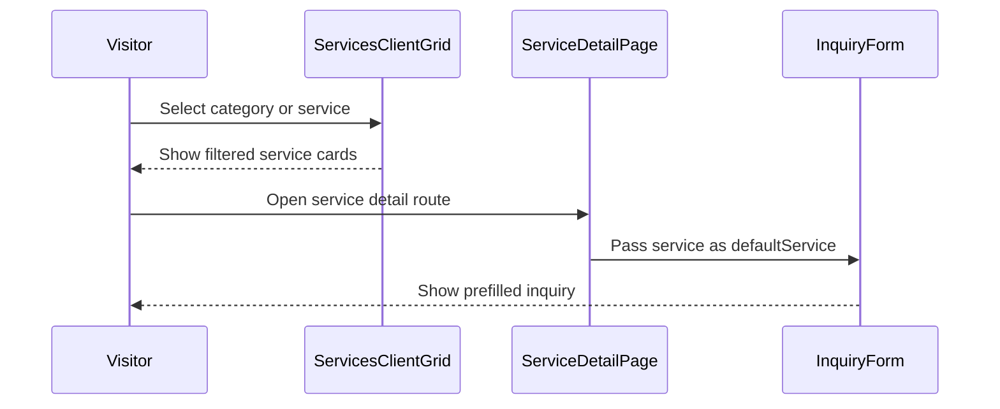

<!-- This is an auto-generated comment: summarize by coderabbit.ai -->
<!-- review_stack_entry_start -->

[](https://app.coderabbit.ai/change-stack/erfanansarioct10-oss/black-swa-v1/pull/7?utm_source=github_walkthrough&utm_medium=github&utm_campaign=change_stack)

<!-- review_stack_entry_end -->
<!-- walkthrough_start -->

<details>
<summary>📝 Walkthrough</summary>

## Walkthrough

The PR replaces the legacy services presentation with a 15-service broadcast catalog, category filtering, static detail pages, structured metadata, service-prefilled inquiries, sitemap entries, light section styling, and updated project records. It also removes the previous About Us reference content.

### Changes

**Broadcast services experience**

| Layer / File(s)                                                                                                                                                                                                                 | Summary                                                                                                                                                 |
| ------------------------------------------------------------------------------------------------------------------------------------------------------------------------------------------------------------------------------- | ------------------------------------------------------------------------------------------------------------------------------------------------------- |
| **Service catalog and implementation contract** <br> `constants/services.ts`, `context/implementation-specs/...`                                                                                                                | Defines five service categories, shared content interfaces, 15 service records, category tabs, and derived popular services.                            |
| **Catalog page and category filtering** <br> `app/(public)/services/page.tsx`, `components/services/services-client-grid.tsx`                                                                                                   | Renders the broadcast services page with dynamic offers, statistics, category filters, responsive cards, deliverables, detail links, and inquiry links. |
| **Static service detail pages** <br> `app/(public)/services/[slug]/page.tsx`                                                                                                                                                    | Adds static slug generation, metadata, JSON-LD, detailed service content, FAQs, SLA information, and a prefilled inquiry sidebar.                       |
| **Inquiry prefilling and route discovery** <br> `components/contact/contact-form.tsx`, `components/contact/inquiry-form.tsx`, `app/sitemap.ts`                                                                                  | Resolves service query parameters, creates service-specific inquiry text, and adds service detail routes to the sitemap.                                |
| **Light presentation and project records** <br> `components/sections/enterprise-advantage-section.tsx`, `components/sections/get-in-touch-section.tsx`, `context/implementation-specs/README.md`, `context/progress-tracker.md` | Updates sections to light visual styles and records the services system as approved and completed.                                                      |

**Estimated code review effort:** 4 (Complex) | ~45 minutes

### Sequence Diagram(s)



**Possibly related PRs**

- [erfanansarioct10-oss/black-swa-v1#1](https://github.com/erfanansarioct10-oss/black-swa-v1/pull/1): Updates the same public services page and service offerings.
- [erfanansarioct10-oss/black-swa-v1#2](https://github.com/erfanansarioct10-oss/black-swa-v1/pull/2): Provides service infrastructure extended by this catalog and detail-page system.
- [erfanansarioct10-oss/black-swa-v1#3](https://github.com/erfanansarioct10-oss/black-swa-v1/pull/3): Shares changes to the contact forms and enterprise advantage section.

</details>

<!-- walkthrough_end -->
<!-- pre_merge_checks_walkthrough_start -->

<details>
<summary>🚥 Pre-merge checks | ✅ 4 | ❌ 1</summary>

### ❌ Failed checks (1 warning)

|     Check name     | Status     | Explanation                                                                          | Resolution                                                                         |
| :----------------: | :--------- | :----------------------------------------------------------------------------------- | :--------------------------------------------------------------------------------- |
| Docstring Coverage | ⚠️ Warning | Docstring coverage is 0.00% which is insufficient. The required threshold is 80.00%. | Write docstrings for the functions missing them to satisfy the coverage threshold. |

<details>
<summary>✅ Passed checks (4 passed)</summary>

|         Check name         | Status    | Explanation                                                                                              |
| :------------------------: | :-------- | :------------------------------------------------------------------------------------------------------- |
|     Description Check      | ✅ Passed | Check skipped - CodeRabbit’s high-level summary is enabled.                                              |
|        Title check         | ✅ Passed | The title clearly summarizes the 15-service broadcast page, detail blog system, and light theme changes. |
|    Linked Issues check     | ✅ Passed | Check skipped because no linked issues were found for this pull request.                                 |
| Out of Scope Changes check | ✅ Passed | Check skipped because no linked issues were found for this pull request.                                 |

</details>

</details>

<!-- pre_merge_checks_walkthrough_end -->
<!-- finishing_touch_checkbox_start -->

<details>
<summary>✨ Finishing Touches 💡 1</summary>

<!-- finishing_touch_suggestion:docstrings -->
<details>
<summary>📝 Generate docstrings 💡</summary>

- [ ] <!-- {"checkboxId": "7962f53c-55bc-4827-bfbf-6a18da830691"} --> Create stacked PR
- [ ] <!-- {"checkboxId": "3e1879ae-f29b-4d0d-8e06-d12b7ba33d98"} --> Commit on current branch

</details>
<details>
<summary>🧪 Generate unit tests (beta)</summary>

- [ ] <!-- {"checkboxId": "f47ac10b-58cc-4372-a567-0e02b2c3d479", "radioGroupId": "utg-output-choice-group-unknown_comment_id"} -->   Create PR with unit tests
- [ ] <!-- {"checkboxId": "6ba7b810-9dad-11d1-80b4-00c04fd430c8", "radioGroupId": "utg-output-choice-group-unknown_comment_id"} -->   Commit unit tests in branch `about-us`

</details>

</details>

<!-- finishing_touch_checkbox_end -->
<!-- tips_start -->

---

<sub>Comment `@coderabbitai help` to get the list of available commands.</sub>

<!-- tips_end -->

**Actionable comments posted: 7**

<details>
<summary>🧹 Nitpick comments (5)</summary><blockquote>

<details>
<summary>app/(public)/services/page.tsx (1)</summary><blockquote>

`61-69`: _📐 Maintainability & Code Quality_ | _🔵 Trivial_ | _⚡ Quick win_

**Derive the service count from `ALL_SERVICES`.**

The hero text hard-codes "15 specialized engineering solutions" and the statistic shows "15+". The catalog contains exactly 15 entries. Both strings drift when a service is added or removed.

<details>
<summary>♻️ Proposed refactor</summary>

```diff
           <p className="text-slate-600 text-sm sm:text-base lg:text-lg max-w-4xl leading-relaxed">
-            From 24/7 linear playout automation and newsroom computer systems (NRCS) to high-density IP TV headends, satellite teleport operations, and custom OB van coachbuilding—explore our 15 specialized engineering solutions backed by guaranteed SLA support.
+            From 24/7 linear playout automation and newsroom computer systems (NRCS) to high-density IPTV headends, satellite teleport operations, and custom OB van coachbuilding—explore our {ALL_SERVICES.length} specialized engineering solutions backed by guaranteed SLA support.
           </p>
@@
             <div>
-              <span className="text-xl sm:text-2xl font-black text-slate-900">15+</span>
+              <span className="text-xl sm:text-2xl font-black text-slate-900">{ALL_SERVICES.length}</span>
               <p className="text-xs text-slate-500 uppercase font-semibold">Specialized Services</p>
             </div>
```

</details>

<details>
<summary>🤖 Prompt for AI Agents</summary>

```
Verify each finding against current code. Fix only still-valid issues, skip the
rest with a brief reason, keep changes minimal, and validate.

In `@app/`(public)/services/page.tsx around lines 61 - 69, Update the services
page hero copy and “Specialized Services” statistic to derive their count from
the ALL_SERVICES collection instead of hard-coding 15. Preserve the existing
wording and formatting, using ALL_SERVICES.length for both displayed values so
they stay synchronized with the catalog.
```

</details>

<!-- cr-comment:v1:9406538084e283fa1ca0f411 -->

</blockquote></details>
<details>
<summary>components/services/services-client-grid.tsx (1)</summary><blockquote>

`49-57`: _📐 Maintainability & Code Quality_ | _🔵 Trivial_ | _⚡ Quick win_

**Expose the active filter state to assistive technology.**

The tab buttons show the active state only through color. Screen reader users receive no state information. Add `aria-pressed` to each button.

<details>
<summary>♿ Proposed fix</summary>

```diff
             <button
               key={tab.id}
+              type="button"
+              aria-pressed={isActive}
               onClick={() => setActiveTab(tab.id)}
```

</details>

<details>
<summary>🤖 Prompt for AI Agents</summary>

```
Verify each finding against current code. Fix only still-valid issues, skip the
rest with a brief reason, keep changes minimal, and validate.

In `@components/services/services-client-grid.tsx` around lines 49 - 57, Update
the tab button in the services grid to include an aria-pressed attribute bound
to the existing isActive state, exposing whether each filter is currently
selected while preserving the existing click and styling behavior.
```

</details>

<!-- cr-comment:v1:25420f130506317a8842f078 -->

</blockquote></details>
<details>
<summary>app/sitemap.ts (1)</summary><blockquote>

`43-48`: _📐 Maintainability & Code Quality_ | _🔵 Trivial_ | _⚡ Quick win_

**Use the service publish date for `lastModified`.**

Every service entry reports the build time as `lastModified`. The content is static and carries `blogContent.publishedDate`. Reporting a changing date on unchanged pages weakens the freshness signal.

<details>
<summary>♻️ Proposed refactor</summary>

```diff
   const serviceSitemapEntries: MetadataRoute.Sitemap = ALL_SERVICES.map((serv) => ({
     url: `${baseUrl}/services/${serv.slug}`,
-    lastModified,
+    lastModified: new Date(serv.blogContent.publishedDate),
     changeFrequency: "weekly",
     priority: 0.8,
   }));
```

</details>

<details>
<summary>🤖 Prompt for AI Agents</summary>

```
Verify each finding against current code. Fix only still-valid issues, skip the
rest with a brief reason, keep changes minimal, and validate.

In `@app/sitemap.ts` around lines 43 - 48, Update the service sitemap mapping in
app/sitemap.ts to set each entry’s lastModified from the corresponding service’s
blogContent.publishedDate instead of the build-time lastModified value, while
preserving the existing URL, frequency, and priority fields.
```

</details>

<!-- cr-comment:v1:f9311915fe6c64a3cfa7c41d -->

</blockquote></details>
<details>
<summary>app/(public)/services/[slug]/page.tsx (1)</summary><blockquote>

`285-309`: _📐 Maintainability & Code Quality_ | _🔵 Trivial_ | _⚡ Quick win_

**Add `FAQPage` structured data for the rendered FAQ.**

The page renders visible question and answer pairs but emits only `Service` and `TechArticle` JSON-LD. A `FAQPage` graph makes these pairs eligible for rich results, which matches the SEO goal in the spec.

<details>
<summary>🔎 Proposed addition</summary>

```tsx
const faqSchema = {
  "`@context`": "https://schema.org",
  "`@type`": "FAQPage",
  mainEntity: service.blogContent.faq.map((faq) => ({
    "`@type`": "Question",
    name: faq.question,
    acceptedAnswer: { "`@type`": "Answer", text: faq.answer },
  })),
};
```

```diff
       <JsonLd data={serviceDetailSchema} />
       <JsonLd data={articleSchema} />
+      <JsonLd data={faqSchema} />
```

</details>

<details>
<summary>🤖 Prompt for AI Agents</summary>

```
Verify each finding against current code. Fix only still-valid issues, skip the
rest with a brief reason, keep changes minimal, and validate.

In `@app/`(public)/services/[slug]/page.tsx around lines 285 - 309, Add FAQPage
JSON-LD structured data for the FAQ rendered by the
`service.blogContent.faq.map` section. Define a schema containing each question
and its accepted answer, then emit it through the page’s existing JSON-LD
mechanism alongside the `Service` and `TechArticle` data.
```

</details>

<!-- cr-comment:v1:4a1f52f8fe5bb05e4f14b5ef -->

</blockquote></details>
<details>
<summary>public/services/tv-distribution.webp (1)</summary><blockquote>

`1-1`: _🧹 Nitpick_ | _🔵 Trivial_

**Note AI-generated provenance embedded in this image asset.**

This file is a binary image asset, not source code, so no functional review applies. The embedded C2PA metadata identifies the image as AI-generated: one `c2pa.actions.v2` entry states `"Created by Google Generative AI."` with `digitalSourceType` `trainedAlgorithmicMedia`, and another states `"Applied imperceptible SynthID watermark."`. Confirm that using AI-generated imagery for this service page is acceptable, and check if any disclosure is required for the broadcast services catalog.

<details>
<summary>🤖 Prompt for AI Agents</summary>

```
Verify each finding against current code. Fix only still-valid issues, skip the
rest with a brief reason, keep changes minimal, and validate.

In `@public/services/tv-distribution.webp` at line 1, Confirm that the
AI-generated imagery in the tv-distribution asset is approved for the service
page, and verify whether the broadcast services catalog requires an AI-content
disclosure; update the asset or associated catalog/page metadata only if policy
requires it.
```

</details>

<!-- cr-comment:v1:32d1b5c74489759b0c5f442b -->

</blockquote></details>

</blockquote></details>

<details>
<summary>🤖 Prompt for all review comments with AI agents</summary>

```
Verify each finding against current code. Fix only still-valid issues, skip the
rest with a brief reason, keep changes minimal, and validate.

Inline comments:
In `@components/contact/contact-form.tsx`:
- Around line 10-14: Update defaultServiceName in ContactFormInner to use only
the matching catalog service title; when serviceSlug does not resolve through
ALL_SERVICES, leave it undefined rather than falling back to the raw query
parameter.

In `@components/contact/inquiry-form.tsx`:
- Around line 38-40: Update ContactFormInner so formData, managed by
useSimulatedFormSubmit, is synchronized whenever the derived defaultServiceName
changes, replacing the stale prefilled message while preserving user-entered
values where appropriate.

In `@components/services/services-client-grid.tsx`:
- Line 35: Update the filter row container in the services client grid to remove
the undefined scrollbar-none class or replace it with a utility defined by the
project, ensuring horizontal scrolling remains available without displaying the
scrollbar.

In `@constants/services.ts`:
- Around line 495-496: Update the longDescription text for Black Swan’s
Character Generator entry to replace “a intuitive template designer” with “an
intuitive template designer,” leaving the rest of the description unchanged.
- Line 546: Update the highlight string in the Technical Specifications list to
remove the duplicated “Fill/Key” wording, while preserving the intended Key &
Fill SDI output pair description.
- Line 194: Update the NRCS service description in the service constants to
remove the duplicated “rundown” wording, while preserving the intended meaning
and ensuring the corrected text is used wherever the description is rendered.

In `@context/implementation-specs/15-services-page-and-detail-blog-system.md`:
- Line 22: Update the services grid entry to list the five categories and labels
defined by CATEGORY_TABS in constants/services.ts, including “Graphics &
Display,” “Distribution & Telecom,” and “Turnkey & Infrastructure.” Update the
card styling entry to match ServicesClientGrid’s shipped light styling: bg-white
with border-slate-200/90 instead of the dark charcoal classes.

---

Nitpick comments:
In `@app/`(public)/services/[slug]/page.tsx:
- Around line 285-309: Add FAQPage JSON-LD structured data for the FAQ rendered
by the `service.blogContent.faq.map` section. Define a schema containing each
question and its accepted answer, then emit it through the page’s existing
JSON-LD mechanism alongside the `Service` and `TechArticle` data.

In `@app/`(public)/services/page.tsx:
- Around line 61-69: Update the services page hero copy and “Specialized
Services” statistic to derive their count from the ALL_SERVICES collection
instead of hard-coding 15. Preserve the existing wording and formatting, using
ALL_SERVICES.length for both displayed values so they stay synchronized with the
catalog.

In `@app/sitemap.ts`:
- Around line 43-48: Update the service sitemap mapping in app/sitemap.ts to set
each entry’s lastModified from the corresponding service’s
blogContent.publishedDate instead of the build-time lastModified value, while
preserving the existing URL, frequency, and priority fields.

In `@components/services/services-client-grid.tsx`:
- Around line 49-57: Update the tab button in the services grid to include an
aria-pressed attribute bound to the existing isActive state, exposing whether
each filter is currently selected while preserving the existing click and
styling behavior.

In `@public/services/tv-distribution.webp`:
- Line 1: Confirm that the AI-generated imagery in the tv-distribution asset is
approved for the service page, and verify whether the broadcast services catalog
requires an AI-content disclosure; update the asset or associated catalog/page
metadata only if policy requires it.
```

</details>

<details>
<summary>🪄 Autofix (Beta)</summary>

Fix all unresolved CodeRabbit comments on this PR:

- [ ] <!-- {"checkboxId": "4b0d0e0a-96d7-4f10-b296-3a18ea78f0b9"} --> Push a commit to this branch (recommended)
- [ ] <!-- {"checkboxId": "ff5b1114-7d8c-49e6-8ac1-43f82af23a33"} --> Create a new PR with the fixes

</details>

---

<details>
<summary>ℹ️ Review info</summary>

<details>
<summary>⚙️ Run configuration</summary>

**Configuration used**: defaults

**Review profile**: CHILL

**Plan**: Pro Plus

**Run ID**: `4b1ce80e-f842-40ae-b64b-204d9d6f5b3e`

</details>

<details>
<summary>📥 Commits</summary>

Reviewing files that changed from the base of the PR and between f939a7e305fa1e9620b8dfc05c42ecf3465239ee and 49215b1be3adc63c60c89b4561effcd3e394a810.

</details>

<details>
<summary>📒 Files selected for processing (28)</summary>

- `about-us-referance.md`
- `app/(public)/services/[slug]/page.tsx`
- `app/(public)/services/page.tsx`
- `app/sitemap.ts`
- `components/contact/contact-form.tsx`
- `components/contact/inquiry-form.tsx`
- `components/sections/enterprise-advantage-section.tsx`
- `components/sections/get-in-touch-section.tsx`
- `components/services/services-client-grid.tsx`
- `constants/services.ts`
- `context/implementation-specs/15-services-page-and-detail-blog-system.md`
- `context/implementation-specs/README.md`
- `context/progress-tracker.md`
- `public/services/cas.webp`
- `public/services/character-generator.webp`
- `public/services/equipment-sales.webp`
- `public/services/ingest-system.webp`
- `public/services/iptv.webp`
- `public/services/mam.webp`
- `public/services/multiviewer.webp`
- `public/services/nrcs.webp`
- `public/services/ob-van-solution.webp`
- `public/services/playout-scheduler.webp`
- `public/services/realtime-3d-cg.webp`
- `public/services/sms.webp`
- `public/services/teleport-services.webp`
- `public/services/tv-distribution.webp`
- `public/services/videowall-processor.webp`

</details>

<details>
<summary>💤 Files with no reviewable changes (1)</summary>

- about-us-referance.md

</details>

</details>

<!-- This is an auto-generated comment by CodeRabbit for review status -->
