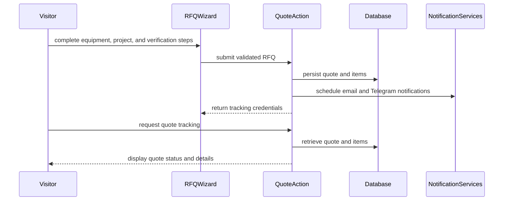

<!-- This is an auto-generated comment: summarize by coderabbit.ai -->
<!-- review_stack_entry_start -->

[](https://app.coderabbit.ai/change-stack/erfanansarioct10-oss/black-swa-v1/pull/10?utm_source=github_walkthrough&utm_medium=github&utm_campaign=change_stack)

<!-- review_stack_entry_end -->
<!-- walkthrough_start -->

<details>
<summary>📝 Walkthrough</summary>

## Walkthrough

This change delivers a quote platform with transactional RFQ submission, contact inquiries, notifications, public quote tracking, persistent cart state, Clerk-protected administration, database migrations, and supporting navigation, audit, and project documentation.

### Changes

**Quote and inquiry platform**

| Layer / File(s)                                                                                                                                                                                | Summary                                                                                                                                           |
| ---------------------------------------------------------------------------------------------------------------------------------------------------------------------------------------------- | ------------------------------------------------------------------------------------------------------------------------------------------------- |
| **Quote contracts and persistence** <br> `schemas/*`, `types/quote.ts`, `db/*`, `supabase/migrations/*`, `supabase/seed.sql`                                                                   | Adds quote and inquiry schemas, domain types, database tables, indexes, RLS policies, migrations, and seed records.                               |
| **Quote actions and notifications** <br> `actions/quote.ts`, `lib/email.ts`, `lib/telegram.ts`, `lib/turnstile.ts`, `lib/html.ts`                                                              | Adds transactional quote creation, tracking lookups, Turnstile validation, and asynchronous email and Telegram notifications.                     |
| **RFQ cart and wizard** <br> `components/providers/quote-cart-provider.tsx`, `components/quote/*`                                                                                              | Adds cart notes, storage synchronization, a three-step RFQ wizard, draft persistence, validation, consent, confirmation, and submission handling. |
| **Public quote tracking** <br> `app/(public)/quote/track/*`, `components/quote/quote-tracking-*.tsx`                                                                                           | Adds tracking search, token and reference lookup, status timelines, quote details, equipment display, and print support.                          |
| **Contact inquiry submission** <br> `schemas/contact.ts`, `actions/contact.ts`, `components/contact/inquiry-form.tsx`, `supabase/migrations/20260801000002_create_contact_inquiries_table.sql` | Adds validated, Turnstile-protected inquiry persistence with non-blocking email and Telegram notifications.                                       |
| **Administration and authentication** <br> `app/admin/*`, `app/layout.tsx`, `proxy.ts`                                                                                                         | Adds Clerk provider integration, protected admin routing, branded login, and an admin dashboard.                                                  |
| **Navigation and presentation updates** <br> `components/layout/*`, `components/ui/breadcrumbs.tsx`, `components/sections/*`                                                                   | Adds quote-tracking links, print exclusions, service detail links, and updated image loading behavior.                                            |
| **Project records and tooling** <br> `context/*`, `next.json`, `package.json`                                                                                                                  | Adds implementation specifications, audit records, roadmap updates, auditor configuration, Supabase reset tooling, and package overrides.         |

**Estimated code review effort:** 5 (Critical) | ~120 minutes

### Sequence Diagram(s)



**Possibly related PRs**

- [erfanansarioct10-oss/black-swa-v1#1](https://github.com/erfanansarioct10-oss/black-swa-v1/pull/1): Shares updates to public layout components and the quote cart provider.
- [erfanansarioct10-oss/black-swa-v1#2](https://github.com/erfanansarioct10-oss/black-swa-v1/pull/2): Provides the earlier quote cart and quote-request UI extended by this change.
- [erfanansarioct10-oss/black-swa-v1#3](https://github.com/erfanansarioct10-oss/black-swa-v1/pull/3): Shares the contact inquiry form later replaced with server-action submission.

</details>

<!-- walkthrough_end -->
<!-- pre_merge_checks_walkthrough_start -->

<details>
<summary>🚥 Pre-merge checks | ✅ 3 | ❌ 2</summary>

### ❌ Failed checks (1 warning, 1 inconclusive)

|     Check name     | Status          | Explanation                                                                                                                         | Resolution                                                                                                                |
| :----------------: | :-------------- | :---------------------------------------------------------------------------------------------------------------------------------- | :------------------------------------------------------------------------------------------------------------------------ |
| Docstring Coverage | ⚠️ Warning      | Docstring coverage is 27.59% which is insufficient. The required threshold is 80.00%.                                               | Write docstrings for the functions missing them to satisfy the coverage threshold.                                        |
|    Title check     | ❓ Inconclusive | The title indicates completion of Phase 3 but does not identify the quote system, tracking portal, notifications, or admin changes. | Replace the title with a concise summary of the main change, such as "Complete Phase 3 quote system and tracking portal". |

<details>
<summary>✅ Passed checks (3 passed)</summary>

|         Check name         | Status    | Explanation                                                              |
| :------------------------: | :-------- | :----------------------------------------------------------------------- |
|     Description Check      | ✅ Passed | Check skipped - CodeRabbit’s high-level summary is enabled.              |
|    Linked Issues check     | ✅ Passed | Check skipped because no linked issues were found for this pull request. |
| Out of Scope Changes check | ✅ Passed | Check skipped because no linked issues were found for this pull request. |

</details>

</details>

<!-- pre_merge_checks_walkthrough_end -->
<!-- finishing_touch_checkbox_start -->

<details>
<summary>✨ Finishing Touches 💡 1</summary>

<!-- finishing_touch_suggestion:docstrings -->
<details>
<summary>📝 Generate docstrings 💡</summary>

- [ ] <!-- {"checkboxId": "7962f53c-55bc-4827-bfbf-6a18da830691"} --> Create stacked PR
- [ ] <!-- {"checkboxId": "3e1879ae-f29b-4d0d-8e06-d12b7ba33d98"} --> Commit on current branch

</details>
<details>
<summary>🧪 Generate unit tests (beta)</summary>

- [ ] <!-- {"checkboxId": "f47ac10b-58cc-4372-a567-0e02b2c3d479", "radioGroupId": "utg-output-choice-group-unknown_comment_id"} -->   Create PR with unit tests
- [ ] <!-- {"checkboxId": "6ba7b810-9dad-11d1-80b4-00c04fd430c8", "radioGroupId": "utg-output-choice-group-unknown_comment_id"} -->   Commit unit tests in branch `phase3-done`

</details>

</details>

<!-- finishing_touch_checkbox_end -->
<!-- tips_start -->

---

<sub>Comment `@coderabbitai help` to get the list of available commands.</sub>

<!-- tips_end -->

**Actionable comments posted: 19**

> [!NOTE]
> Due to the large number of review comments, Critical, Major severity comments were prioritized as inline comments.

<details>
<summary>🟡 Minor comments (12)</summary><blockquote>

<details>
<summary>next.json-8-10 (1)</summary><blockquote>

`8-10`: _📐 Maintainability & Code Quality_ | _🟡 Minor_ | _⚡ Quick win_

**Match the declared PostgreSQL version to Supabase configuration.**

`next.json` declares PostgreSQL 15. `supabase/config.toml` declares `db.major_version = 17`. Set this value to 17, or explicitly document separate local and production versions. Otherwise, audit agents can apply incorrect compatibility assumptions.

<details>
<summary>🤖 Prompt for AI Agents</summary>

```
Verify each finding against current code. Fix only still-valid issues, skip the
rest with a brief reason, keep changes minimal, and validate.

In `@next.json` around lines 8 - 10, Update the database declaration in the
frontend stack metadata to PostgreSQL 17 so it matches supabase/config.toml’s
db.major_version; only retain PostgreSQL 15 if the configuration explicitly
documents separate local and production versions.
```

</details>

<!-- cr-comment:v1:e4ec615caa7f7119aaa7a3d3 -->

</blockquote></details>
<details>
<summary>context/code-rabbits-comments/coderabbit-comment-after-last-commit-50ed465.md-133-133 (1)</summary><blockquote>

`133-133`: _📐 Maintainability & Code Quality_ | _🟡 Minor_ | _⚡ Quick win_

**Specify a language for each prompt code fence.**

markdownlint reports MD040 for these opening fences. Use `text` for the agent prompts so documentation lint has no warnings.

Also applies to: 163-163, 196-196, 232-232, 278-278, 328-328, 359-359, 399-399, 445-445, 477-477, 530-530, 578-578, 608-608, 655-655, 693-693, 751-751, 819-819, 846-846, 902-902, 931-931, 982-982, 1009-1009, 1053-1053, 1101-1101, 1144-1144, 1207-1207, 1233-1233, 1274-1274, 1303-1303, 1353-1353, 1376-1376

<details>
<summary>🤖 Prompt for AI Agents</summary>

```
Verify each finding against current code. Fix only still-valid issues, skip the
rest with a brief reason, keep changes minimal, and validate.

In
`@context/code-rabbits-comments/coderabbit-comment-after-last-commit-50ed465.md`
at line 133, Update every listed prompt code fence in the documentation to
specify the text language on its opening fence, including all occurrences
identified by the review, so markdownlint MD040 passes without changing the
prompt contents.
```

</details>

<!-- cr-comment:v1:69e16c998af24785cf6256a9 -->

_Source: Linters/SAST tools_

</blockquote></details>
<details>
<summary>context/implementation-specs/17-phase-3a-quote-database-schema-and-server-actions.md-24-28 (1)</summary><blockquote>

`24-28`: _📐 Maintainability & Code Quality_ | _🟡 Minor_ | _⚡ Quick win_

**Replace all machine-local documentation links.**

The `file:///c:/black-swan-v1/...` URLs fail in GitHub and other checkouts.

- `context/implementation-specs/17-phase-3a-quote-database-schema-and-server-actions.md#L24-L28`: replace each URL with a repository-relative path.
- `context/implementation-specs/README.md#L173-L188`: replace each registry URL with a relative specification filename, matching the Phase 3 entries below it.

<details>
<summary>🤖 Prompt for AI Agents</summary>

```
Verify each finding against current code. Fix only still-valid issues, skip the
rest with a brief reason, keep changes minimal, and validate.

In
`@context/implementation-specs/17-phase-3a-quote-database-schema-and-server-actions.md`
around lines 24 - 28, Replace the machine-local file:///c:/black-swan-v1/ URLs
in
context/implementation-specs/17-phase-3a-quote-database-schema-and-server-actions.md
lines 24-28 with repository-relative paths for each listed file. Also update the
registry URLs in context/implementation-specs/README.md lines 173-188 to the
matching relative Phase 3 specification filenames; make no other documentation
changes.
```

</details>

<!-- cr-comment:v1:2eca2aff64ad928a9631997d -->

</blockquote></details>
<details>
<summary>context/implementation-specs/20-phase-3d-public-quote-tracking-portal.md-43-48 (1)</summary><blockquote>

`43-48`: _📐 Maintainability & Code Quality_ | _🟡 Minor_ | _⚡ Quick win_

**Update spec text to match the implementation.**

Line 45 states the form uses `react-hook-form` + `@hookform/resolvers/zod`. The shipped `QuoteTrackingSearchForm` uses `useState` and `quoteTrackingLookupSchema.safeParse` directly, with no `react-hook-form` dependency involved.

Update the spec to describe the actual implementation, so the document stays a reliable reference for future audits.

<details>
<summary>🤖 Prompt for AI Agents</summary>

```
Verify each finding against current code. Fix only still-valid issues, skip the
rest with a brief reason, keep changes minimal, and validate.

In `@context/implementation-specs/20-phase-3d-public-quote-tracking-portal.md`
around lines 43 - 48, Update the Step 1 description for QuoteTrackingSearchForm
to state that it manages form state with useState and validates submissions
directly via quoteTrackingLookupSchema.safeParse. Remove the inaccurate
react-hook-form and `@hookform/resolvers/zod` references while preserving the rest
of the search-page behavior.
```

</details>

<!-- cr-comment:v1:13df7b54d4ec982e31b267f5 -->

</blockquote></details>
<details>
<summary>components/quote/quote-tracking-details.tsx-31-35 (1)</summary><blockquote>

`31-35`: _🩺 Stability & Availability_ | _🟡 Minor_ | _⚡ Quick win_

**Handle clipboard failures.**

`navigator.clipboard.writeText` can be unavailable (non-secure context, unsupported browser) or its returned promise can reject (for example, permission denial). Neither case is handled here, so the click can throw or leave an unhandled promise rejection.

<details>
<summary>🛡️ Proposed fix</summary>

```diff
   const handleCopyRef = () => {
-    navigator.clipboard.writeText(quote.referenceId);
-    setCopied(true);
-    setTimeout(() => setCopied(false), 2000);
+    if (!navigator.clipboard) return;
+    navigator.clipboard
+      .writeText(quote.referenceId)
+      .then(() => {
+        setCopied(true);
+        setTimeout(() => setCopied(false), 2000);
+      })
+      .catch(() => {
+        /* clipboard write failed; no-op */
+      });
   };
```

</details>

<details>
<summary>🤖 Prompt for AI Agents</summary>

```
Verify each finding against current code. Fix only still-valid issues, skip the
rest with a brief reason, keep changes minimal, and validate.

In `@components/quote/quote-tracking-details.tsx` around lines 31 - 35, Update
handleCopyRef to guard against an unavailable navigator.clipboard.writeText API
and handle rejected write promises. Only set copied state and schedule its reset
after the clipboard write succeeds, while safely handling failures without
throwing or creating unhandled promise rejections.
```

</details>

<!-- cr-comment:v1:fcabe3e505af832c0a7c0fd2 -->

</blockquote></details>
<details>
<summary>components/quote/quote-tracking-timeline.tsx-96-116 (1)</summary><blockquote>

`96-116`: _🎯 Functional Correctness_ | _🟡 Minor_ | _⚡ Quick win_

**Fix: final step never shows the completed state.**

For `status === "completed"`, `currentStepIndex` equals 5, the index of the last step. Line 96 and Line 97 make `isCompleted` false and `isCurrent` true for that step, so the last circle keeps the "current" ring style with the `Flag` icon instead of the green checkmark used for completed steps. The stepper never visually confirms the final milestone as done.

Treat the last step as completed when the overall status is `completed`.

<details>
<summary>🎯 Proposed fix</summary>

```diff
             const stepNumber = idx + 1;
-            const isCompleted = stepNumber < currentStepIndex;
-            const isCurrent = stepNumber === currentStepIndex;
+            const isCompleted =
+              stepNumber < currentStepIndex || (status === "completed" && stepNumber === currentStepIndex);
+            const isCurrent = stepNumber === currentStepIndex && status !== "completed";
```

</details>

<details>
<summary>🤖 Prompt for AI Agents</summary>

```
Verify each finding against current code. Fix only still-valid issues, skip the
rest with a brief reason, keep changes minimal, and validate.

In `@components/quote/quote-tracking-timeline.tsx` around lines 96 - 116, Update
the completion-state logic in the step rendering within the quote tracking
timeline so the final step is treated as completed when the overall status is
"completed". Ensure this makes the last circle use the existing completed
styling and CheckCircle2 icon instead of the current-step styling, while
preserving behavior for other statuses and steps.
```

</details>

<!-- cr-comment:v1:8da47e42f114655ef7c4f6a9 -->

</blockquote></details>
<details>
<summary>components/quote/rfq-wizard-steps.tsx-96-98 (1)</summary><blockquote>

`96-98`: _🎯 Functional Correctness_ | _🟡 Minor_ | _⚡ Quick win_

**Collapsing one item's notes also collapses every other item's notes.**

`activeNotesId` holds a single value but controls the expansion of all rows. `isNotesExpanded` is true for a row when `activeNotesId === item.id`, or when `activeNotesId === null` and that row has notes.

Consider two items, A and B, that both have notes. The initial `activeNotesId` is `null`, so both rows are expanded. The user clicks the toggle on row A. `activeNotesId` becomes `"collapsed-A"`. Row B now fails both conditions, so row B collapses as well.

Track the expanded rows as a set of item IDs instead of a single ID.

<details>
<summary>🐛 Proposed fix</summary>

```diff
-  const [activeNotesId, setActiveNotesId] = useState<string | null>(null);
+  const [collapsedNotesIds, setCollapsedNotesIds] = useState<Set<string>>(new Set());
+  const [expandedNotesIds, setExpandedNotesIds] = useState<Set<string>>(new Set());
```

```diff
           const hasNotes = Boolean(item.notes && item.notes.trim().length > 0);
-          const isNotesExpanded = activeNotesId === item.id || (activeNotesId === null && hasNotes);
+          const isNotesExpanded = expandedNotesIds.has(item.id)
+            || (hasNotes && !collapsedNotesIds.has(item.id));
```

```diff
                   onClick={() =>
-                    setActiveNotesId(isNotesExpanded ? `collapsed-${item.id}` : item.id)
+                    isNotesExpanded
+                      ? (setExpandedNotesIds((prev) => {
+                          const next = new Set(prev);
+                          next.delete(item.id);
+                          return next;
+                        }),
+                        setCollapsedNotesIds((prev) => new Set(prev).add(item.id)))
+                      : (setCollapsedNotesIds((prev) => {
+                          const next = new Set(prev);
+                          next.delete(item.id);
+                          return next;
+                        }),
+                        setExpandedNotesIds((prev) => new Set(prev).add(item.id)))
                   }
```

</details>

Also applies to: 157-166

<details>
<summary>🤖 Prompt for AI Agents</summary>

```
Verify each finding against current code. Fix only still-valid issues, skip the
rest with a brief reason, keep changes minimal, and validate.

In `@components/quote/rfq-wizard-steps.tsx` around lines 96 - 98, Update the notes
expansion state used by the RFQ wizard so it tracks a set of expanded item IDs
rather than a single activeNotesId value. Adjust the initialization and toggle
logic around the mapped QuoteCartItem rows, including the handler near the notes
controls, so toggling one item only changes that item’s expansion state while
preserving each row’s current state.
```

</details>

<!-- cr-comment:v1:9a1d1a9430eb592b123b7222 -->

</blockquote></details>
<details>
<summary>context/implementation-specs/18-phase-3b-interactive-quote-cart-and-multi-step-rfq-wizard-ui.md-130-130 (1)</summary><blockquote>

`130-130`: _🔒 Security & Privacy_ | _🟡 Minor_ | _⚡ Quick win_

**The implemented Turnstile fallback is not limited to development.**

This row states that the bypass applies when the site key is absent in local development. The implementation in `components/quote/rfq-wizard-steps.tsx` Line 457 substitutes the Cloudflare test site key in every environment. Align the code with this documented intent, or update the spec.

<details>
<summary>🤖 Prompt for AI Agents</summary>

```
Verify each finding against current code. Fix only still-valid issues, skip the
rest with a brief reason, keep changes minimal, and validate.

In
`@context/implementation-specs/18-phase-3b-interactive-quote-cart-and-multi-step-rfq-wizard-ui.md`
at line 130, Restrict the Turnstile test-site-key fallback in the RFQ wizard
implementation around the site-key handling in rfq-wizard-steps.tsx to
development mode only, preserving configured keys and production behavior. If
the intended behavior is environment-independent, update the “Turnstile Widget
Failures in Local Dev” specification row instead to document that scope.
```

</details>

<!-- cr-comment:v1:67ad2837f5f668b084756fdb -->

</blockquote></details>
<details>
<summary>db/migrations/0000_nappy_silverclaw.sql-1-43 (1)</summary><blockquote>

`1-43`: _🗄️ Data Integrity & Integration_ | _🟡 Minor_ | _⚡ Quick win_

**Choose one owner for the quote schema.** `supabase db reset` applies Supabase migrations, while `db:push` can apply the Drizzle schema to the same database. The current definitions match, but future changes can diverge. Remove the duplicate SQL or document the ownership rule.

<details>
<summary>🤖 Prompt for AI Agents</summary>

```
Verify each finding against current code. Fix only still-valid issues, skip the
rest with a brief reason, keep changes minimal, and validate.

In `@db/migrations/0000_nappy_silverclaw.sql` around lines 1 - 43, Define a single
owner for the quote schema represented by the profiles, quotes, and quote_items
tables, and remove this duplicate migration or document the authoritative
migration workflow so Supabase migrations and Drizzle db:push cannot diverge.
Preserve the existing schema through the chosen ownership path.
```

</details>

<!-- cr-comment:v1:8317a8eb8cee5eb733a4095e -->

</blockquote></details>
<details>
<summary>supabase/seed.sql-33-36 (1)</summary><blockquote>

`33-36`: _🔒 Security & Privacy_ | _🟡 Minor_ | _⚡ Quick win_

**Use reserved example identities in seed data.**

The seed row uses a real organization name and a plausible real email domain, `stjude-health.org`. Seed data is committed and is easy to copy into other environments. An accidental notification dispatch would then reach an external domain. Use names and addresses from reserved ranges, for example `@example.com` and a fictional company name.

<details>
<summary>🛡️ Proposed change</summary>

```diff
-  'Dr. Alexander Vance',
-  'a.vance@stjude-health.org',
+  'Dr. Alexander Vance',
+  'a.vance@example.com',
   '+1 (555) 019-2834',
-  'St. Jude Medical Center',
+  'Example Regional Medical Center',
```

</details>

<details>
<summary>🤖 Prompt for AI Agents</summary>

```
Verify each finding against current code. Fix only still-valid issues, skip the
rest with a brief reason, keep changes minimal, and validate.

In `@supabase/seed.sql` around lines 33 - 36, Update the seed row containing “Dr.
Alexander Vance” to use a fictional organization name and a reserved
example-domain email address, such as `@example.com`. Keep the phone number in a
non-production example format and preserve the row’s structure and intent.
```

</details>

<!-- cr-comment:v1:e5bdf4015be3e2fe03a4af17 -->

</blockquote></details>
<details>
<summary>context/implementation-specs/21-phase-3-refinements-and-bug-fixes.md-26-26 (1)</summary><blockquote>

`26-26`: _📐 Maintainability & Code Quality_ | _🟡 Minor_ | _⚡ Quick win_

**Keep the Markdown table at three columns.**

The inline `||` expression on Line [26] is parsed as extra table separators. `markdownlint-cli2` reports MD056. Move the expression outside the table or reference the implementation step instead.

<details>
<summary>Proposed documentation fix</summary>

```diff
-| 2   | `lib/email.ts` | **[MODIFY]** Update `baseUrl` fallback to `process.env.NEXT_PUBLIC_APP_URL || "http://localhost:3000"`. |
+| 2   | `lib/email.ts` | **[MODIFY]** Update the `baseUrl` fallback described in Step 1. |
```

</details>

<details>
<summary>🤖 Prompt for AI Agents</summary>

```
Verify each finding against current code. Fix only still-valid issues, skip the
rest with a brief reason, keep changes minimal, and validate.

In `@context/implementation-specs/21-phase-3-refinements-and-bug-fixes.md` at line
26, Update the Phase 3 implementation-spec table entry for lib/email.ts to keep
exactly three Markdown columns; remove the inline `||` expression from the table
cell and describe the baseUrl fallback without table-separator syntax, or
reference the implementation step instead.
```

</details>

<!-- cr-comment:v1:c853ec770b48fed477df4c5c -->

_Source: Linters/SAST tools_

</blockquote></details>
<details>
<summary>components/contact/inquiry-form.tsx-256-263 (1)</summary><blockquote>

`256-263`: _🎯 Functional Correctness_ | _🟡 Minor_ | _⚡ Quick win_

**Handle Turnstile token expiry and widget errors.**

Clear `turnstileToken` in both supported `onExpire` and `onError` callbacks so the form does not submit an expired token.

<details>
<summary>🤖 Prompt for AI Agents</summary>

```
Verify each finding against current code. Fix only still-valid issues, skip the
rest with a brief reason, keep changes minimal, and validate.

In `@components/contact/inquiry-form.tsx` around lines 256 - 263, Update the
Turnstile component in the inquiry form to provide both onExpire and onError
callbacks that clear turnstileToken via the existing setter. Preserve the
current onSuccess behavior while ensuring expired or errored widgets cannot
leave a stale token available for submission.
```

</details>

<!-- cr-comment:v1:5d74855757a2c0bacca830f3 -->

</blockquote></details>

</blockquote></details>

<details>
<summary>🧹 Nitpick comments (15)</summary><blockquote>

<details>
<summary>app/layout.tsx (1)</summary><blockquote>

`80-82`: _📐 Maintainability & Code Quality_ | _🔵 Trivial_ | _⚡ Quick win_

**Scope `suppressHydrationWarning` to a proven mismatch.**

The new prop on both root elements suppresses hydration diagnostics at the application boundary. It does not fix a server/client mismatch. Keep the prop only on the specific element that requires it. At minimum, remove it from `<body>` unless a test identifies that requirement.

<details>
<summary>Suggested change</summary>

```diff
-      <body className="min-h-full flex flex-col" suppressHydrationWarning>
+      <body className="min-h-full flex flex-col">
```

</details>

<details>
<summary>🤖 Prompt for AI Agents</summary>

```
Verify each finding against current code. Fix only still-valid issues, skip the
rest with a brief reason, keep changes minimal, and validate.

In `@app/layout.tsx` around lines 80 - 82, Remove the unnecessary
suppressHydrationWarning prop from the body element in the root layout, while
retaining it on the specific root element with the proven hydration mismatch.
Keep the body className and surrounding layout structure unchanged.
```

</details>

<!-- cr-comment:v1:a9931185534d0debc49da4f8 -->

</blockquote></details>
<details>
<summary>context/implementation-specs/18-phase-3b-interactive-quote-cart-and-multi-step-rfq-wizard-ui.md (1)</summary><blockquote>

`5-5`: _📐 Maintainability & Code Quality_ | _🔵 Trivial_ | _💤 Low value_

**Update the spec status and fix a hyphenation nit.**

Line 5 states `Status: Draft`. This PR delivers the implementation described in the spec. Update the status to reflect the delivered state.

Line 38 uses "single page forms" as a compound modifier. Write "single-page forms".

Also applies to: 38-38

<details>
<summary>🤖 Prompt for AI Agents</summary>

```
Verify each finding against current code. Fix only still-valid issues, skip the
rest with a brief reason, keep changes minimal, and validate.

In
`@context/implementation-specs/18-phase-3b-interactive-quote-cart-and-multi-step-rfq-wizard-ui.md`
at line 5, Update the specification status on the Status line from Draft to the
appropriate delivered state, and change the compound modifier “single page
forms” to “single-page forms” at the referenced text.
```

</details>

<!-- cr-comment:v1:70067aaf9897d9879b8a3238 -->

_Source: Linters/SAST tools_

</blockquote></details>
<details>
<summary>schemas/quote.ts (2)</summary><blockquote>

`30-37`: _🔒 Security & Privacy_ | _🔵 Trivial_ | _⚡ Quick win_

**Add maximum lengths to the free-text fields.**

`companyName`, `projectScope`, `budgetRange`, `timeline`, and `quoteItemSchema.notes` accept unbounded strings. The server action persists these directly into `text` columns. A client can submit multi-megabyte payloads. Add `.max(...)` limits that match the expected content size.

<details>
<summary>🛡️ Proposed limits</summary>

```diff
-  companyName: z.string().trim().optional(),
-  projectScope: z.string().trim().optional(),
-  budgetRange: z.string().trim().optional(),
-  timeline: z.string().trim().optional(),
+  companyName: z.string().trim().max(150).optional(),
+  projectScope: z.string().trim().max(5000).optional(),
+  budgetRange: z.string().trim().max(100).optional(),
+  timeline: z.string().trim().max(100).optional(),
```

```diff
-  notes: z.string().optional(),
+  notes: z.string().max(2000).optional(),
```

</details>

<details>
<summary>🤖 Prompt for AI Agents</summary>

```
Verify each finding against current code. Fix only still-valid issues, skip the
rest with a brief reason, keep changes minimal, and validate.

In `@schemas/quote.ts` around lines 30 - 37, Update the quote schema’s free-text
fields—companyName, projectScope, budgetRange, timeline, and
quoteItemSchema.notes—to apply appropriate maximum-length validation before
persistence. Preserve their existing trimming and optional behavior, and use
limits consistent with the expected content size.
```

</details>

<!-- cr-comment:v1:d1c45ac2d28e31c9b79f5b96 -->

---

`20-24`: _📐 Maintainability & Code Quality_ | _🔵 Trivial_ | _⚡ Quick win_

**Use the Zod 4 email schema without losing normalization**

Zod `4.4.3` supports chained `.email()`, but the method is deprecated. Pipe the trimmed and lowercased string into `z.email({ error: ... })` at Lines 24 and 50.

<details>
<summary>🤖 Prompt for AI Agents</summary>

```
Verify each finding against current code. Fix only still-valid issues, skip the
rest with a brief reason, keep changes minimal, and validate.

In `@schemas/quote.ts` around lines 20 - 24, Update the email schemas at the
visible quote schema fields, including the corresponding field near line 50, to
pipe the trimmed and lowercased string into Zod 4’s top-level z.email({ error:
... }) validator. Preserve the existing validation message and normalization
order while removing the deprecated chained .email() call.
```

</details>

<!-- cr-comment:v1:d1d0daf22c88a908aee5cdd9 -->

</blockquote></details>
<details>
<summary>components/providers/quote-cart-provider.tsx (1)</summary><blockquote>

`82-121`: _🎯 Functional Correctness_ | _🔵 Trivial_ | _⚡ Quick win_

**Derive mutations from storage instead of the render-time snapshot.**

`addItem`, `removeItem`, `updateQuantity`, and `updateNotes` all read the `items` value captured in the current render. React batches the re-render caused by `dispatchEvent`. If two mutations run inside one event handler or one microtask, the second call reads the stale `items` array and overwrites the first write.

Reading the current snapshot inside the mutator removes the dependency on render timing.

Note also that `updateNotes` runs on every keystroke of the notes textarea in `components/quote/rfq-wizard-steps.tsx` Line 180. Each keystroke serializes the whole cart, writes to `localStorage`, dispatches an event, and re-parses the JSON. Consider keeping the textarea value in local component state and calling `updateNotes` on blur or after a debounce.

<details>
<summary>♻️ Proposed refactor</summary>

```diff
+  const readCurrentItems = (): QuoteCartItem[] => {
+    try {
+      const parsed: unknown = JSON.parse(getQuoteCartSnapshot());
+      return Array.isArray(parsed) ? parsed.filter(isQuoteCartItem) : [];
+    } catch {
+      return [];
+    }
+  };
+
   const addItem = (product: { id: string; name: string; sku: string; category: string }) => {
-    const existing = items.find((item) => item.id === product.id);
+    const current = readCurrentItems();
+    const existing = current.find((item) => item.id === product.id);
     let updated: QuoteCartItem[];
     if (existing) {
-      updated = items.map((item) =>
+      updated = current.map((item) =>
         item.id === product.id ? { ...item, quantity: item.quantity + 1 } : item
       );
     } else {
-      updated = [...items, { ...product, quantity: 1 }];
+      updated = [...current, { ...product, quantity: 1 }];
     }
     saveItemsToStorage(updated);
   };

   const removeItem = (id: string) => {
-    const updated = items.filter((item) => item.id !== id);
+    const updated = readCurrentItems().filter((item) => item.id !== id);
     saveItemsToStorage(updated);
   };

   const updateQuantity = (id: string, quantity: number) => {
     if (quantity <= 0) {
       removeItem(id);
       return;
     }
-    const updated = items.map((item) => (item.id === id ? { ...item, quantity } : item));
+    const updated = readCurrentItems().map((item) =>
+      item.id === id ? { ...item, quantity } : item
+    );
     saveItemsToStorage(updated);
   };

   const updateNotes = (id: string, notes: string) => {
-    const updated = items.map((item) => (item.id === id ? { ...item, notes } : item));
+    const updated = readCurrentItems().map((item) =>
+      item.id === id ? { ...item, notes } : item
+    );
     saveItemsToStorage(updated);
   };
```

</details>

<details>
<summary>🤖 Prompt for AI Agents</summary>

```
Verify each finding against current code. Fix only still-valid issues, skip the
rest with a brief reason, keep changes minimal, and validate.

In `@components/providers/quote-cart-provider.tsx` around lines 82 - 121, Update
addItem, removeItem, updateQuantity, and updateNotes to derive the latest cart
items from localStorage at mutation time instead of the render-captured items
value, then persist each mutation from that snapshot. Also change the notes
textarea flow in rfq-wizard-steps to keep edits in local state and call
updateNotes on blur or with debouncing rather than on every keystroke.
```

</details>

<!-- cr-comment:v1:7da9bc099b029b8456710ffc -->

</blockquote></details>
<details>
<summary>types/quote.ts (1)</summary><blockquote>

`43-46`: _📐 Maintainability & Code Quality_ | _🔵 Trivial_ | _💤 Low value_

**Move the import to the top of the file.**

The type import sits after the interface declarations. Type imports are erased at compile time, so behavior does not change. Placement at the top matches normal module structure and makes the dependency visible.

<details>
<summary>♻️ Proposed reorganization</summary>

```diff
+import type { QuoteItemSchemaType, CreateQuoteSchemaType } from "`@/schemas/quote`";
+
 export type QuoteStatus =
```

```diff
-import type { QuoteItemSchemaType, CreateQuoteSchemaType } from "`@/schemas/quote`";
-
 export type CreateQuoteItemInput = QuoteItemSchemaType;
```

</details>

<details>
<summary>🤖 Prompt for AI Agents</summary>

```
Verify each finding against current code. Fix only still-valid issues, skip the
rest with a brief reason, keep changes minimal, and validate.

In `@types/quote.ts` around lines 43 - 46, Move the type-only import of
QuoteItemSchemaType and CreateQuoteSchemaType to the top of types/quote.ts,
before the interface and type declarations, while leaving the existing type
definitions unchanged.
```

</details>

<!-- cr-comment:v1:6fbb65a58a9a0e1616da2aa6 -->

</blockquote></details>
<details>
<summary>lib/html.ts (1)</summary><blockquote>

`5-12`: _🔒 Security & Privacy_ | _🔵 Trivial_ | _💤 Low value_

**The escaping is correct for the current call sites.**

The replacement order handles `&` first, so no double-escaping occurs. The five characters cover text nodes and quoted attribute values.

The static analysis hint recommends DOMPurify or sanitize-html. Those libraries sanitize untrusted markup and keep allowed tags. This function escapes text so that no markup survives. They solve different problems, and neither one runs in an email template or in a Telegram `parse_mode: "HTML"` payload. I consider the hint a false positive here.

One constraint to record: the output is not safe inside an unquoted HTML attribute, inside a `<script>` block, or inside a `style` value. Add that limit to the JSDoc so later callers do not extend the usage.

<details>
<summary>🤖 Prompt for AI Agents</summary>

```
Verify each finding against current code. Fix only still-valid issues, skip the
rest with a brief reason, keep changes minimal, and validate.

In `@lib/html.ts` around lines 5 - 12, Update the JSDoc for escapeHtml to document
that its output is intended for HTML text nodes and quoted attribute values
only, and is not safe for unquoted attributes, script blocks, or style values.
Leave the existing escaping implementation unchanged.
```

</details>

<!-- cr-comment:v1:95608dbec51379b7f06ca276 -->

_Source: Linters/SAST tools_

</blockquote></details>
<details>
<summary>db/seed.mjs (1)</summary><blockquote>

`74-74`: _🩺 Stability & Availability_ | _🔵 Trivial_ | _⚡ Quick win_

**Handle a rejection from `run()`.**

`run()` is called without `await` or `.catch()`. The `try` block captures the insert errors. The `finally` block calls `await sql.end()`. If `sql.end()` rejects, the returned promise rejects with no handler, and Node reports an unhandled rejection and exits with a non-zero code and a stack trace.

<details>
<summary>🛡️ Proposed fix</summary>

```diff
-run();
+run().catch((err) => {
+  console.error('Seeding script terminated unexpectedly:', err);
+  process.exitCode = 1;
+});
```

</details>

<details>
<summary>🤖 Prompt for AI Agents</summary>

```
Verify each finding against current code. Fix only still-valid issues, skip the
rest with a brief reason, keep changes minimal, and validate.

In `@db/seed.mjs` at line 74, Update the top-level run invocation to handle the
promise returned by run(), including rejections from its finally cleanup via
sql.end(). Attach a rejection handler that reports the error and exits with the
intended failure status, rather than leaving the promise unhandled.
```

</details>

<!-- cr-comment:v1:540d8f8dc60a67c9f725021c -->

</blockquote></details>
<details>
<summary>lib/email.ts (1)</summary><blockquote>

`63-151`: _📐 Maintainability & Code Quality_ | _🔵 Trivial_ | _⚖️ Poor tradeoff_

**Extract the shared email layout.**

`generateQuoteConfirmationHtml` and `generateContactInquiryHtml` repeat the same document shell: the `<head>` block, the outer wrapper table, the dark header band, and the footer. Only the title, the heading text, and the body cell differ. A style change now requires two edits, and the two templates drift.

Extract one `renderEmailShell({ title, heading, bodyHtml })` helper and call it from both functions.

Also applies to: 208-277

<details>
<summary>🤖 Prompt for AI Agents</summary>

```
Verify each finding against current code. Fix only still-valid issues, skip the
rest with a brief reason, keep changes minimal, and validate.

In `@lib/email.ts` around lines 63 - 151, Extract the duplicated document
structure from generateQuoteConfirmationHtml and generateContactInquiryHtml into
a shared renderEmailShell({ title, heading, bodyHtml }) helper. Keep the common
head, outer wrapper, dark header, and footer in that helper, while each function
supplies its title, heading, and body content; preserve the existing
template-specific body markup and escaping.
```

</details>

<!-- cr-comment:v1:9c6a9daf054f29a935f5c82c -->

</blockquote></details>
<details>
<summary>actions/quote.ts (2)</summary><blockquote>

`174-189`: _🔒 Security & Privacy_ | _🔵 Trivial_ | _🏗️ Heavy lift_

**Add rate limiting to the public quote lookup paths.**

`getQuoteByTrackingAction` and `getQuoteByLookupTokenAction` are public server actions that accept unauthenticated input. Neither applies a rate limit. An attacker can call them repeatedly to guess a reference ID and email pair, or a lookup token. Each call also runs two unindexed queries. Apply a per-IP rate limit at the middleware or action level.

<details>
<summary>🤖 Prompt for AI Agents</summary>

```
Verify each finding against current code. Fix only still-valid issues, skip the
rest with a brief reason, keep changes minimal, and validate.

In `@actions/quote.ts` around lines 174 - 189, Add per-IP rate limiting to both
public actions, getQuoteByTrackingAction and getQuoteByLookupTokenAction, before
their database queries execute. Reuse the project’s existing rate-limit
middleware or utility, reject requests that exceed the limit, and ensure
unauthenticated callers cannot bypass it through either lookup path.
```

</details>

<!-- cr-comment:v1:b6178e0a70beb2fe191fb142 -->

---

`98-108`: _🩺 Stability & Availability_ | _🔵 Trivial_ | _⚡ Quick win_

**Unwrap Drizzle’s `cause` before matching the unique violation.**

Drizzle wraps the `postgres.js` error in `err.cause`. Check `cause.code === "23505"` and `cause.constraint_name === "quotes_reference_id_unique"`. Do not match the outer error message or retry `quotes_lookup_token_unique`.

<details>
<summary>🤖 Prompt for AI Agents</summary>

```
Verify each finding against current code. Fix only still-valid issues, skip the
rest with a brief reason, keep changes minimal, and validate.

In `@actions/quote.ts` around lines 98 - 108, Update the retry condition in the
quote action’s catch block to inspect the Drizzle error’s cause, requiring
cause.code to equal "23505" and cause.constraint_name to equal
"quotes_reference_id_unique". Remove outer error-message matching and ensure
violations of "quotes_lookup_token_unique" are not retried; preserve the
existing attempts limit and rethrow behavior.
```

</details>

<!-- cr-comment:v1:1b0037b9b6bd3f51904b67de -->

</blockquote></details>
<details>
<summary>db/schema.ts (1)</summary><blockquote>

`26-26`: _🗄️ Data Integrity & Integration_ | _🔵 Trivial_ | _⚡ Quick win_

**Constrain `status` at the database level.**

`quotes.status` and `contactInquiries.status` are free `text`. `types/quote.ts` declares a closed `QuoteStatus` union, and `actions/quote.ts` casts the database value with `as QuoteWithItems["status"]`. The cast hides any value that the union does not contain. Use `pgEnum`, or add a `CHECK` constraint in a migration, so the database rejects unknown status values.

Also applies to: 60-60

<details>
<summary>🤖 Prompt for AI Agents</summary>

```
Verify each finding against current code. Fix only still-valid issues, skip the
rest with a brief reason, keep changes minimal, and validate.

In `@db/schema.ts` at line 26, Constrain the status columns for quotes and contact
inquiries at the database level instead of leaving them as unrestricted text.
Update the schema definitions for the symbols at the shown status fields to use
pgEnum values matching the declared status unions, or add an equivalent
migration CHECK constraint, and ensure existing defaults and valid statuses
remain supported.
```

</details>

<!-- cr-comment:v1:9ff9c838b6988ebff7e29db0 -->

</blockquote></details>
<details>
<summary>lib/telegram.ts (1)</summary><blockquote>

`64-92`: _📐 Maintainability & Code Quality_ | _🔵 Trivial_ | _⚡ Quick win_

**Extract the shared Telegram dispatch block.**

`sendTelegramQuoteAlert` and `sendTelegramContactInquiryAlert` repeat the same code: the credential read, the URL construction, the `fetch` call with the 8000 ms timeout, the status check, and the two `catch` shapes. Only `messageText` differs. Extract one `sendTelegramMessage(text: string)` function, and reduce each public function to message construction plus one call.

<details>
<summary>♻️ Proposed refactor</summary>

```ts
async function sendTelegramMessage(
  text: string,
  context: string,
): Promise<{ success: boolean; error?: string }> {
  const botToken = process.env.TELEGRAM_BOT_TOKEN;
  const chatId = process.env.TELEGRAM_CHAT_ID;

  if (!botToken || !chatId) {
    console.warn(
      `[Telegram Dev Fallback] TELEGRAM_BOT_TOKEN or TELEGRAM_CHAT_ID is not configured. ${context} skipped in local environment.`,
    );
    return { success: true };
  }

  try {
    const response = await fetch(
      `https://api.telegram.org/bot${botToken}/sendMessage`,
      {
        method: "POST",
        headers: { "Content-Type": "application/json" },
        body: JSON.stringify({ chat_id: chatId, text, parse_mode: "HTML" }),
        signal: AbortSignal.timeout(8000),
      },
    );

    if (!response.ok) {
      console.error("[Telegram Bot API Error]:", await response.text());
      return {
        success: false,
        error: `Telegram API returned status ${response.status}`,
      };
    }
    return { success: true };
  } catch (err) {
    console.error("[Telegram Alert Exception]:", err);
    return {
      success: false,
      error:
        err instanceof Error ? err.message : "Unknown Telegram alert error",
    };
  }
}
```

</details>

Also applies to: 135-163

<details>
<summary>🤖 Prompt for AI Agents</summary>

```
Verify each finding against current code. Fix only still-valid issues, skip the
rest with a brief reason, keep changes minimal, and validate.

In `@lib/telegram.ts` around lines 64 - 92, Extract the duplicated Telegram
dispatch logic from sendTelegramQuoteAlert and sendTelegramContactInquiryAlert
into a shared sendTelegramMessage(text: string) helper. Move credential reads,
configuration fallback, URL construction, fetch options, 8000 ms timeout,
response handling, and exception handling into the helper, then reduce both
public functions to constructing their message and calling it.
```

</details>

<!-- cr-comment:v1:89f6ae5c9017bd2bc1f9ff76 -->

</blockquote></details>
<details>
<summary>supabase/seed.sql (1)</summary><blockquote>

`1-25`: _📐 Maintainability & Code Quality_ | _🔵 Trivial_ | _⚡ Quick win_

**The same sample quote data exists in two seed implementations.** Both files insert the identical two quotes and their line items, one through SQL and one through the `postgres` client. The values drift apart on the next change, and a reader cannot tell which file is authoritative.

- `supabase/seed.sql#L1-L25`: keep this file as the single source of the sample data, because `supabase db reset` runs it automatically.
- `db/seed.mjs#L10-L63`: replace the inline `INSERT` statements with `await sql.file('supabase/seed.sql')`, or delete the script and document `supabase db reset` as the seeding command.

<details>
<summary>🤖 Prompt for AI Agents</summary>

```
Verify each finding against current code. Fix only still-valid issues, skip the
rest with a brief reason, keep changes minimal, and validate.

In `@supabase/seed.sql` around lines 1 - 25, The sample quote data in
supabase/seed.sql should remain the single authoritative seed source; make no
direct changes there. In db/seed.mjs, remove the duplicated inline INSERT
statements and invoke the SQL client’s file execution method with
supabase/seed.sql instead, or remove the script and document supabase db reset
as the seeding command.
```

</details>

<!-- cr-comment:v1:dd546d7001f98b0501ff02b6 -->

</blockquote></details>
<details>
<summary>actions/contact.ts (1)</summary><blockquote>

`49-77`: _🩺 Stability & Availability_ | _🔵 Trivial_

**Confirm `after()` reliability on the target deployment platform.**

`after()` depends on the runtime providing `waitUntil`. On Vercel this works out of the box; on a self-hosted Node server, `waitUntil` must be implemented explicitly, or the scheduled email/Telegram dispatch may not run to completion.

<details>
<summary>🤖 Prompt for AI Agents</summary>

```
Verify each finding against current code. Fix only still-valid issues, skip the
rest with a brief reason, keep changes minimal, and validate.

In `@actions/contact.ts` around lines 49 - 77, Update the `after()` usage in the
contact action to ensure the target deployment runtime provides a `waitUntil`
implementation, adding the required self-hosted Node integration or fallback so
the `Promise.allSettled` dispatch completes reliably. Preserve the existing
email and Telegram dispatch behavior and result logging.
```

</details>

<!-- cr-comment:v1:9687d495334f7417d55c1997 -->

</blockquote></details>

</blockquote></details>

<details>
<summary>🤖 Prompt for all review comments with AI agents</summary>

```
Verify each finding against current code. Fix only still-valid issues, skip the
rest with a brief reason, keep changes minimal, and validate.

Inline comments:
In `@actions/contact.ts`:
- Around line 83-93: The catch block in the contact submission action must stop
exposing error.message to callers. Keep the detailed error in the existing
console.error server log, but always return a generic user-safe error message in
the failure response from the catch block.

In `@actions/quote.ts`:
- Around line 158-168: Update the catch block in the quote request action to
always return a fixed, user-safe error message instead of exposing
error.message, including Drizzle/PostgreSQL and ZodError details. Preserve the
existing server-side console.error logging of the caught error and align the
returned response with the fixed-message pattern used by the two read actions in
this file.

In `@app/admin/page.tsx`:
- Around line 27-49: Update the admin dashboard metrics in the page component
around the Active RFQ Requests, Assigned Quotes, and System Status cards to use
live server-side data from the existing quotes and quote_items stores plus the
available health checks. Replace hardcoded 0, Active (Dev), and Phase 3A pending
values with queried counts and connection status; if those integrations are
unavailable, explicitly present the dashboard as a scaffold using Unknown or Not
connected values instead of implying real state.

In `@components/contact/inquiry-form.tsx`:
- Around line 28-29: Update the turnstileSiteKey configuration in the inquiry
form to detect when NEXT_PUBLIC_TURNSTILE_SITE_KEY is unset and the test
fallback is selected; outside development, log a warning that the production
Turnstile configuration is missing, while preserving the existing fallback and
development behavior.

In `@components/providers/quote-cart-provider.tsx`:
- Around line 51-54: Update getQuoteCartSnapshot to wrap
localStorage.getItem(STORAGE_KEY) in try/catch, returning the existing "[]"
fallback when storage access throws or has no value. Preserve the server-side
window guard and keep saveItemsToStorage unchanged.

In `@components/quote/quote-request.tsx`:
- Around line 17-26: Update the Clerk prefill guards in the form initialization
logic around formData.fullName and formData.email to test for empty values
rather than only undefined, allowing the user?.fullName/user?.firstName and
user?.primaryEmailAddress fallbacks to apply. Preserve the existing EMPTY_FORM
defaults and ensure the fallback behavior remains consistent with the current
render flow.
- Around line 164-179: Clear formData state before or alongside storage cleanup
in the successful submission handler so the persist effects cannot rewrite
submitted values after setCurrentStep(4). Apply the same formData reset in
onReset, and remove its manual sessionStorage removeItem calls as requested;
preserve the existing cart-clearing and step-reset behavior.

In `@components/quote/rfq-wizard-steps.tsx`:
- Around line 457-458: In components/quote/rfq-wizard-steps.tsx lines 457-458,
update turnstileSiteKey to read NEXT_PUBLIC_TURNSTILE_SITE_KEY directly and
remove the always-passing fallback, preserving the existing missing-key ternary
and bypass notice. In
context/implementation-specs/18-phase-3b-interactive-quote-cart-and-multi-step-rfq-wizard-ui.md
line 130, confirm the mitigation row matches this behavior or restate it to
describe the missing-key notice.

In `@context/implementation-specs/21-phase-3-refinements-and-bug-fixes.md`:
- Around line 53-55: Update the baseUrl configuration to require
NEXT_PUBLIC_APP_URL when running in production, failing safely instead of
falling back to localhost; retain the http://localhost:3000 fallback only for
non-production environments.

In
`@context/implementation-specs/22-supabase-rls-security-and-index-optimizations.md`:
- Around line 61-95: Remove the unrestricted public RLS policies for profiles,
quotes, and quote_items at
context/implementation-specs/22-supabase-rls-security-and-index-optimizations.md:61-95;
retain access through server actions or a narrowly scoped RPC that validates
proof and allowlists results. At :156-157, replace the documented postgres
runtime role with a dedicated least-privilege role that lacks BYPASSRLS. At
context/progress-tracker.md:22, mark the work incomplete until deployed policies
and runtime credentials are verified.

In
`@context/implementation-specs/24-pre-commit-audit-polish-and-code-deduplication.md`:
- Around line 70-77: Update the Turnstile validation guard to bypass missing
keys or test dummy keys only when NODE_ENV is not production; in production,
return false and fail closed. Preserve the existing token handling and
non-production warning behavior in the surrounding Turnstile validation logic.

In `@db/schema.ts`:
- Around line 31-33: Add indexes supporting the expressions used by
getQuoteByTrackingAction: create migration-backed expression indexes for
UPPER(reference_id) and LOWER(email), alongside the existing quote indexes.
Ensure the indexed expressions exactly match the lookup predicates and preserve
the current reference_id uniqueness behavior.

In `@lib/email.ts`:
- Around line 28-36: Update generateQuoteConfirmationHtml to include lookupToken
from SendQuoteConfirmationEmailParams and build trackingUrl using the detail
route path with the encoded referenceId and encoded token query parameter,
replacing the current referenceId query-only URL.

In `@lib/turnstile.ts`:
- Around line 24-38: Update the Turnstile verification fetch in the surrounding
verification function to pass an AbortSignal.timeout(8000) signal, matching the
existing external-request pattern in telegram.ts. Handle timeout failures
explicitly so production returns false, while preserving the current
non-production fallback behavior for other exceptions.
- Around line 5-17: Update verifyTurnstileToken so missing TURNSTILE_SECRET_KEY
or NEXT_PUBLIC_TURNSTILE_SITE_KEY, and Cloudflare dummy-key bypasses, are
allowed only outside production. In production, return false when Turnstile
configuration is missing or uses test keys, while preserving the existing
non-production bypass behavior and token validation flow.

In `@proxy.ts`:
- Around line 8-10: Update the pathname-based middleware around isAdminRoute and
isAdminLoginRoute to enforce the configured Managing Director or Sales
Engineering Clerk role/permission server-side, not merely authentication via
auth.protect(). In context/audit-reports/End-to-End System Audit Report.md lines
6, 21-23, and 90-95, describe pathname-based middleware instead of
createRouteMatcher and remove the 100/100, Production Grade, and
strict-protection claims until authorization is implemented.

In `@supabase/migrations/20260801000000_create_quotes_tables.sql`:
- Around line 1-9: Align the existing profiles timestamp columns with the
Drizzle schema by adding an ALTER migration for profiles.created_at and
profiles.updated_at using timestamptz and UTC conversion; apply this in
supabase/migrations/20260801000000_create_quotes_tables.sql lines 1-9 or a new
migration. Keep db/schema.ts lines 9-10 unchanged with withTimezone: true, and
verify drizzle-kit reports no pending diff after migration.

In `@supabase/migrations/20260801000001_enable_rls_and_performance_indexes.sql`:
- Around line 29-33: Update the INSERT policies for quotes and quote_items,
including the policy around “Allow anonymous and authenticated quote creation,”
to prevent unrestricted client writes: remove these policies when creation must
go through createQuoteAction; otherwise replace WITH CHECK (true) with
predicates that require quote status to be 'pending' and reject client-supplied
administrative fields such as assigned_manager_id, admin_notes, and
lookup_token.
- Around line 20-54: Replace the unrestricted SELECT policies for profiles,
quotes, and quote_items with server-side service-role-only access, removing
USING (true) exposure to public clients. Update the policies named “Allow public
read access to profiles”, “Allow quote lookup by reference or token”, and “Allow
quote item lookup”; preserve the existing INSERT policies and ensure server
actions retain the required read access.

---

Minor comments:
In `@components/contact/inquiry-form.tsx`:
- Around line 256-263: Update the Turnstile component in the inquiry form to
provide both onExpire and onError callbacks that clear turnstileToken via the
existing setter. Preserve the current onSuccess behavior while ensuring expired
or errored widgets cannot leave a stale token available for submission.

In `@components/quote/quote-tracking-details.tsx`:
- Around line 31-35: Update handleCopyRef to guard against an unavailable
navigator.clipboard.writeText API and handle rejected write promises. Only set
copied state and schedule its reset after the clipboard write succeeds, while
safely handling failures without throwing or creating unhandled promise
rejections.

In `@components/quote/quote-tracking-timeline.tsx`:
- Around line 96-116: Update the completion-state logic in the step rendering
within the quote tracking timeline so the final step is treated as completed
when the overall status is "completed". Ensure this makes the last circle use
the existing completed styling and CheckCircle2 icon instead of the current-step
styling, while preserving behavior for other statuses and steps.

In `@components/quote/rfq-wizard-steps.tsx`:
- Around line 96-98: Update the notes expansion state used by the RFQ wizard so
it tracks a set of expanded item IDs rather than a single activeNotesId value.
Adjust the initialization and toggle logic around the mapped QuoteCartItem rows,
including the handler near the notes controls, so toggling one item only changes
that item’s expansion state while preserving each row’s current state.

In
`@context/code-rabbits-comments/coderabbit-comment-after-last-commit-50ed465.md`:
- Line 133: Update every listed prompt code fence in the documentation to
specify the text language on its opening fence, including all occurrences
identified by the review, so markdownlint MD040 passes without changing the
prompt contents.

In
`@context/implementation-specs/17-phase-3a-quote-database-schema-and-server-actions.md`:
- Around line 24-28: Replace the machine-local file:///c:/black-swan-v1/ URLs in
context/implementation-specs/17-phase-3a-quote-database-schema-and-server-actions.md
lines 24-28 with repository-relative paths for each listed file. Also update the
registry URLs in context/implementation-specs/README.md lines 173-188 to the
matching relative Phase 3 specification filenames; make no other documentation
changes.

In
`@context/implementation-specs/18-phase-3b-interactive-quote-cart-and-multi-step-rfq-wizard-ui.md`:
- Line 130: Restrict the Turnstile test-site-key fallback in the RFQ wizard
implementation around the site-key handling in rfq-wizard-steps.tsx to
development mode only, preserving configured keys and production behavior. If
the intended behavior is environment-independent, update the “Turnstile Widget
Failures in Local Dev” specification row instead to document that scope.

In `@context/implementation-specs/20-phase-3d-public-quote-tracking-portal.md`:
- Around line 43-48: Update the Step 1 description for QuoteTrackingSearchForm
to state that it manages form state with useState and validates submissions
directly via quoteTrackingLookupSchema.safeParse. Remove the inaccurate
react-hook-form and `@hookform/resolvers/zod` references while preserving the rest
of the search-page behavior.

In `@context/implementation-specs/21-phase-3-refinements-and-bug-fixes.md`:
- Line 26: Update the Phase 3 implementation-spec table entry for lib/email.ts
to keep exactly three Markdown columns; remove the inline `||` expression from
the table cell and describe the baseUrl fallback without table-separator syntax,
or reference the implementation step instead.

In `@db/migrations/0000_nappy_silverclaw.sql`:
- Around line 1-43: Define a single owner for the quote schema represented by
the profiles, quotes, and quote_items tables, and remove this duplicate
migration or document the authoritative migration workflow so Supabase
migrations and Drizzle db:push cannot diverge. Preserve the existing schema
through the chosen ownership path.

In `@next.json`:
- Around line 8-10: Update the database declaration in the frontend stack
metadata to PostgreSQL 17 so it matches supabase/config.toml’s db.major_version;
only retain PostgreSQL 15 if the configuration explicitly documents separate
local and production versions.

In `@supabase/seed.sql`:
- Around line 33-36: Update the seed row containing “Dr. Alexander Vance” to use
a fictional organization name and a reserved example-domain email address, such
as `@example.com`. Keep the phone number in a non-production example format and
preserve the row’s structure and intent.

---

Nitpick comments:
In `@actions/contact.ts`:
- Around line 49-77: Update the `after()` usage in the contact action to ensure
the target deployment runtime provides a `waitUntil` implementation, adding the
required self-hosted Node integration or fallback so the `Promise.allSettled`
dispatch completes reliably. Preserve the existing email and Telegram dispatch
behavior and result logging.

In `@actions/quote.ts`:
- Around line 174-189: Add per-IP rate limiting to both public actions,
getQuoteByTrackingAction and getQuoteByLookupTokenAction, before their database
queries execute. Reuse the project’s existing rate-limit middleware or utility,
reject requests that exceed the limit, and ensure unauthenticated callers cannot
bypass it through either lookup path.
- Around line 98-108: Update the retry condition in the quote action’s catch
block to inspect the Drizzle error’s cause, requiring cause.code to equal
"23505" and cause.constraint_name to equal "quotes_reference_id_unique". Remove
outer error-message matching and ensure violations of
"quotes_lookup_token_unique" are not retried; preserve the existing attempts
limit and rethrow behavior.

In `@app/layout.tsx`:
- Around line 80-82: Remove the unnecessary suppressHydrationWarning prop from
the body element in the root layout, while retaining it on the specific root
element with the proven hydration mismatch. Keep the body className and
surrounding layout structure unchanged.

In `@components/providers/quote-cart-provider.tsx`:
- Around line 82-121: Update addItem, removeItem, updateQuantity, and
updateNotes to derive the latest cart items from localStorage at mutation time
instead of the render-captured items value, then persist each mutation from that
snapshot. Also change the notes textarea flow in rfq-wizard-steps to keep edits
in local state and call updateNotes on blur or with debouncing rather than on
every keystroke.

In
`@context/implementation-specs/18-phase-3b-interactive-quote-cart-and-multi-step-rfq-wizard-ui.md`:
- Line 5: Update the specification status on the Status line from Draft to the
appropriate delivered state, and change the compound modifier “single page
forms” to “single-page forms” at the referenced text.

In `@db/schema.ts`:
- Line 26: Constrain the status columns for quotes and contact inquiries at the
database level instead of leaving them as unrestricted text. Update the schema
definitions for the symbols at the shown status fields to use pgEnum values
matching the declared status unions, or add an equivalent migration CHECK
constraint, and ensure existing defaults and valid statuses remain supported.

In `@db/seed.mjs`:
- Line 74: Update the top-level run invocation to handle the promise returned by
run(), including rejections from its finally cleanup via sql.end(). Attach a
rejection handler that reports the error and exits with the intended failure
status, rather than leaving the promise unhandled.

In `@lib/email.ts`:
- Around line 63-151: Extract the duplicated document structure from
generateQuoteConfirmationHtml and generateContactInquiryHtml into a shared
renderEmailShell({ title, heading, bodyHtml }) helper. Keep the common head,
outer wrapper, dark header, and footer in that helper, while each function
supplies its title, heading, and body content; preserve the existing
template-specific body markup and escaping.

In `@lib/html.ts`:
- Around line 5-12: Update the JSDoc for escapeHtml to document that its output
is intended for HTML text nodes and quoted attribute values only, and is not
safe for unquoted attributes, script blocks, or style values. Leave the existing
escaping implementation unchanged.

In `@lib/telegram.ts`:
- Around line 64-92: Extract the duplicated Telegram dispatch logic from
sendTelegramQuoteAlert and sendTelegramContactInquiryAlert into a shared
sendTelegramMessage(text: string) helper. Move credential reads, configuration
fallback, URL construction, fetch options, 8000 ms timeout, response handling,
and exception handling into the helper, then reduce both public functions to
constructing their message and calling it.

In `@schemas/quote.ts`:
- Around line 30-37: Update the quote schema’s free-text fields—companyName,
projectScope, budgetRange, timeline, and quoteItemSchema.notes—to apply
appropriate maximum-length validation before persistence. Preserve their
existing trimming and optional behavior, and use limits consistent with the
expected content size.
- Around line 20-24: Update the email schemas at the visible quote schema
fields, including the corresponding field near line 50, to pipe the trimmed and
lowercased string into Zod 4’s top-level z.email({ error: ... }) validator.
Preserve the existing validation message and normalization order while removing
the deprecated chained .email() call.

In `@supabase/seed.sql`:
- Around line 1-25: The sample quote data in supabase/seed.sql should remain the
single authoritative seed source; make no direct changes there. In db/seed.mjs,
remove the duplicated inline INSERT statements and invoke the SQL client’s file
execution method with supabase/seed.sql instead, or remove the script and
document supabase db reset as the seeding command.

In `@types/quote.ts`:
- Around line 43-46: Move the type-only import of QuoteItemSchemaType and
CreateQuoteSchemaType to the top of types/quote.ts, before the interface and
type declarations, while leaving the existing type definitions unchanged.
```

</details>

<details>
<summary>🪄 Autofix (Beta)</summary>

Fix all unresolved CodeRabbit comments on this PR:

- [ ] <!-- {"checkboxId": "4b0d0e0a-96d7-4f10-b296-3a18ea78f0b9"} --> Push a commit to this branch (recommended)
- [ ] <!-- {"checkboxId": "ff5b1114-7d8c-49e6-8ac1-43f82af23a33"} --> Create a new PR with the fixes

</details>

---

<details>
<summary>ℹ️ Review info</summary>

<details>
<summary>⚙️ Run configuration</summary>

**Configuration used**: defaults

**Review profile**: CHILL

**Plan**: Pro Plus

**Run ID**: `2e2f6f33-8bdf-4649-a429-1cb8e1a0fe57`

</details>

<details>
<summary>📥 Commits</summary>

Reviewing files that changed from the base of the PR and between 266d01cb0aa1ec578c0d4206c62a9242b5cf5217 and 660e366addd38c7bee3dcd2238fba7b9d8e02e7a.

</details>

<details>
<summary>⛔ Files ignored due to path filters (1)</summary>

- `pnpm-lock.yaml` is excluded by `!**/pnpm-lock.yaml`

</details>

<details>
<summary>📒 Files selected for processing (56)</summary>

- `actions/contact.ts`
- `actions/quote.ts`
- `app/(public)/quote/track/[referenceId]/page.tsx`
- `app/(public)/quote/track/page.tsx`
- `app/admin/login/[[...login]]/page.tsx`
- `app/admin/page.tsx`
- `app/layout.tsx`
- `components/contact/inquiry-form.tsx`
- `components/layout/main-header.tsx`
- `components/layout/mobile-nav.tsx`
- `components/layout/public-footer.tsx`
- `components/providers/quote-cart-provider.tsx`
- `components/quote/quote-request.tsx`
- `components/quote/quote-tracking-details.tsx`
- `components/quote/quote-tracking-search-form.tsx`
- `components/quote/quote-tracking-timeline.tsx`
- `components/quote/rfq-confirmation.tsx`
- `components/quote/rfq-wizard-progress.tsx`
- `components/quote/rfq-wizard-steps.tsx`
- `components/sections/brand-marquee.tsx`
- `components/sections/popular-services-section.tsx`
- `components/ui/breadcrumbs.tsx`
- `context/audit-reports/End-to-End System Audit Report.md`
- `context/code-rabbits-comments/coderabbit-comment-after-last-commit-03e821c.md`
- `context/code-rabbits-comments/coderabbit-comment-after-last-commit-50ed465.md`
- `context/implementation-specs/17-phase-3a-quote-database-schema-and-server-actions.md`
- `context/implementation-specs/18-phase-3b-interactive-quote-cart-and-multi-step-rfq-wizard-ui.md`
- `context/implementation-specs/19-phase-3c-automated-notifications-and-integration-pipeline.md`
- `context/implementation-specs/20-phase-3d-public-quote-tracking-portal.md`
- `context/implementation-specs/21-phase-3-refinements-and-bug-fixes.md`
- `context/implementation-specs/22-supabase-rls-security-and-index-optimizations.md`
- `context/implementation-specs/23-contact-and-service-inquiry-automated-notifications.md`
- `context/implementation-specs/24-pre-commit-audit-polish-and-code-deduplication.md`
- `context/implementation-specs/25-security-vulnerability-overrides.md`
- `context/implementation-specs/README.md`
- `context/progress-tracker.md`
- `db/migrations/0000_nappy_silverclaw.sql`
- `db/migrations/meta/0000_snapshot.json`
- `db/migrations/meta/_journal.json`
- `db/schema.ts`
- `db/seed.mjs`
- `docs/feature-roadmap.md`
- `lib/email.ts`
- `lib/html.ts`
- `lib/telegram.ts`
- `lib/turnstile.ts`
- `next.json`
- `package.json`
- `proxy.ts`
- `schemas/contact.ts`
- `schemas/quote.ts`
- `supabase/migrations/20260801000000_create_quotes_tables.sql`
- `supabase/migrations/20260801000001_enable_rls_and_performance_indexes.sql`
- `supabase/migrations/20260801000002_create_contact_inquiries_table.sql`
- `supabase/seed.sql`
- `types/quote.ts`

</details>

</details>

<!-- This is an auto-generated comment by CodeRabbit for review status -->
