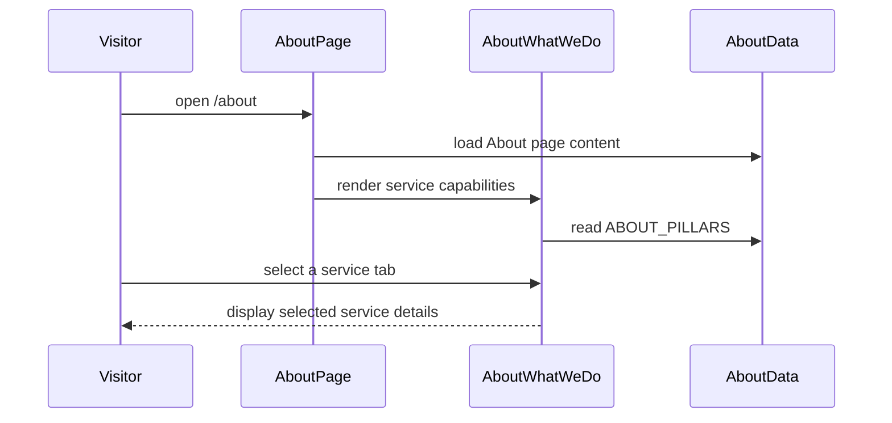

<!-- This is an auto-generated comment: summarize by coderabbit.ai -->
<!-- review_stack_entry_start -->

[](https://app.coderabbit.ai/change-stack/erfanansarioct10-oss/black-swa-v1/pull/6?utm_source=github_walkthrough&utm_medium=github&utm_campaign=change_stack)

<!-- review_stack_entry_end -->
<!-- walkthrough_start -->

<details>
<summary>📝 Walkthrough</summary>

## Walkthrough

The `/about` page now uses modular broadcast and IT content sections. Shared constants provide service, workflow, statistics, and company-value data. The page also includes interactive service tabs, responsive layouts, updated breadcrumbs, and expanded SEO metadata.

### Changes

**About page redesign**

| Layer / File(s)                                                                                                      | Summary                                                                                                                                     |
| -------------------------------------------------------------------------------------------------------------------- | ------------------------------------------------------------------------------------------------------------------------------------------- |
| **About page content model** <br> `constants/about.ts`, `about-us-referance.md`                                      | Shared interfaces and data define statistics, service pillars, workflow steps, company values, and company profile content.                 |
| **About page content sections** <br> `components/sections/about/*`                                                   | New components render the hero, statistics, company profile, identity, workflow, and CTA sections.                                          |
| **Interactive service capabilities** <br> `components/sections/about/about-what-we-do.tsx`, `constants/about.ts`     | The What We Do section provides desktop tabs and responsive mobile and tablet service cards.                                                |
| **Page composition and navigation** <br> `app/(public)/about/page.tsx`, `components/ui/breadcrumbs.tsx`, `context/*` | The About route composes the new sections, updates metadata and JSON-LD, extends breadcrumb styling, and records implementation completion. |

**Estimated code review effort:** 3 (Moderate) | ~25 minutes

### Sequence Diagram(s)



**Possibly related PRs**

- [erfanansarioct10-oss/black-swa-v1#2](https://github.com/erfanansarioct10-oss/black-swa-v1/pull/2): Earlier changes to the same About page included SEO, hero, and `FeatureCard` updates.
- [erfanansarioct10-oss/black-swa-v1#3](https://github.com/erfanansarioct10-oss/black-swa-v1/pull/3): Related “Who We Are” content and About page imagery were added or revised.

</details>

<!-- walkthrough_end -->
<!-- pre_merge_checks_walkthrough_start -->

<details>
<summary>🚥 Pre-merge checks | ✅ 4 | ❌ 1</summary>

### ❌ Failed checks (1 warning)

|     Check name     | Status     | Explanation                                                                          | Resolution                                                                         |
| :----------------: | :--------- | :----------------------------------------------------------------------------------- | :--------------------------------------------------------------------------------- |
| Docstring Coverage | ⚠️ Warning | Docstring coverage is 0.00% which is insufficient. The required threshold is 80.00%. | Write docstrings for the functions missing them to satisfy the coverage threshold. |

<details>
<summary>✅ Passed checks (4 passed)</summary>

|         Check name         | Status    | Explanation                                                                                                              |
| :------------------------: | :-------- | :----------------------------------------------------------------------------------------------------------------------- |
|     Description Check      | ✅ Passed | Check skipped - CodeRabbit’s high-level summary is enabled.                                                              |
|        Title check         | ✅ Passed | The title clearly identifies the About Us page implementation and its brand theme focus, which matches the main changes. |
|    Linked Issues check     | ✅ Passed | Check skipped because no linked issues were found for this pull request.                                                 |
| Out of Scope Changes check | ✅ Passed | Check skipped because no linked issues were found for this pull request.                                                 |

</details>

</details>

<!-- pre_merge_checks_walkthrough_end -->
<!-- finishing_touch_checkbox_start -->

<details>
<summary>✨ Finishing Touches 💡 1</summary>

<!-- finishing_touch_suggestion:docstrings -->
<details>
<summary>📝 Generate docstrings 💡</summary>

- [ ] <!-- {"checkboxId": "7962f53c-55bc-4827-bfbf-6a18da830691"} --> Create stacked PR
- [ ] <!-- {"checkboxId": "3e1879ae-f29b-4d0d-8e06-d12b7ba33d98"} --> Commit on current branch

</details>
<details>
<summary>🧪 Generate unit tests (beta)</summary>

- [ ] <!-- {"checkboxId": "f47ac10b-58cc-4372-a567-0e02b2c3d479", "radioGroupId": "utg-output-choice-group-unknown_comment_id"} -->   Create PR with unit tests
- [ ] <!-- {"checkboxId": "6ba7b810-9dad-11d1-80b4-00c04fd430c8", "radioGroupId": "utg-output-choice-group-unknown_comment_id"} -->   Commit unit tests in branch `about-us`

</details>

</details>

<!-- finishing_touch_checkbox_end -->
<!-- tips_start -->

---

<sub>Comment `@coderabbitai help` to get the list of available commands.</sub>

<!-- tips_end -->

**Actionable comments posted: 4**

<details>
<summary>🧹 Nitpick comments (4)</summary><blockquote>

<details>
<summary>components/sections/about/about-hero.tsx (1)</summary><blockquote>

`1-1`: _📐 Maintainability & Code Quality_ | _🔵 Trivial_ | _⚡ Quick win_

**Ambient radial background markup is duplicated verbatim.** Both files render the identical two-div background pattern (`bg-radial` overlay plus a translated gradient blur), and `about-what-we-do.tsx` even comments that it is "matching homepage," confirming this is a repeated site-wide pattern rather than a one-off.

- `components/sections/about/about-hero.tsx#L9-10`: extract this markup into a shared `AmbientBackground` component and render it here.
- `components/sections/about/about-what-we-do.tsx#L19-20`: replace this duplicate block with the same shared `AmbientBackground` component.

<details>
<summary>🤖 Prompt for AI Agents</summary>

```
Verify each finding against current code. Fix only still-valid issues, skip the
rest with a brief reason, keep changes minimal, and validate.

In `@components/sections/about/about-hero.tsx` at line 1, Extract the duplicated
two-div ambient radial background markup into a shared AmbientBackground
component, then replace the inline blocks in the about hero and about what-we-do
sections with that component. Preserve the existing classes, styling, and
rendered output in both locations.
```

</details>

<!-- cr-comment:v1:a4f4c9934853f7682cd92fb2 -->

</blockquote></details>
<details>
<summary>components/sections/about/about-company-profile.tsx (1)</summary><blockquote>

`1-1`: _📐 Maintainability & Code Quality_ | _🔵 Trivial_ | _⚡ Quick win_

**Image card with floating badge overlay is duplicated across two files.** Both blocks share the same wrapper classes, the same `Award` icon, and the same badge layout, differing only in the image `src`/`alt` and the two badge text strings.

- `components/sections/about/about-company-profile.tsx#L11-39`: extract this block into a shared `ProfileImageCard` component accepting `src`, `alt`, `badgeLabel`, and `badgeTitle` props, and render it here with the Company Profile values.
- `components/sections/about/about-who-we-are.tsx#L52-79`: replace this block with the same `ProfileImageCard` component, passing the engineering-team image and "Professional Teamwork" badge values.

<details>
<summary>🤖 Prompt for AI Agents</summary>

```
Verify each finding against current code. Fix only still-valid issues, skip the
rest with a brief reason, keep changes minimal, and validate.

In `@components/sections/about/about-company-profile.tsx` at line 1, Extract the
duplicated image card and floating Award badge markup into a shared
ProfileImageCard component with src, alt, badgeLabel, and badgeTitle props.
Replace the card blocks in the Company Profile and Who We Are sections with this
component, passing each section’s existing image and badge values while
preserving the current styling and layout.
```

</details>

<!-- cr-comment:v1:6e25d307b95c8fc4269db861 -->

</blockquote></details>
<details>
<summary>constants/about.ts (1)</summary><blockquote>

`69-155`: _📐 Maintainability & Code Quality_ | _🔵 Trivial_ | _⚡ Quick win_

**Distinct pillars reuse the same image.**

`broadcast-integrator` (Line 79) and `headend-systems` (Line 96) both use `/about/broadcast-headend.png`. `ott-services` (Line 113) and `amc-contracts` (Line 147) both use `/about/noc-operations.png`.

`about-what-we-do.tsx` renders `activePillar.image` in the desktop detail panel. A user switching between these tab pairs sees the identical image, which weakens the visual distinction between separately marketed services.

Assign a unique image per pillar.

<details>
<summary>🤖 Prompt for AI Agents</summary>

```
Verify each finding against current code. Fix only still-valid issues, skip the
rest with a brief reason, keep changes minimal, and validate.

In `@constants/about.ts` around lines 69 - 155, Update the image fields in
ABOUT_PILLARS so every pillar has a distinct image asset: replace the duplicate
values used by broadcast-integrator/headend-systems and
ott-services/amc-contracts with unique, appropriate paths, while preserving each
pillar’s existing content and structure.
```

</details>

<!-- cr-comment:v1:94aac7a32a190a96a1058dc4 -->

</blockquote></details>
<details>
<summary>components/sections/about/about-what-we-do.tsx (1)</summary><blockquote>

`40-64`: _🎯 Functional Correctness_ | _🔵 Trivial_ | _⚡ Quick win_

**Desktop tabs lack arrow-key navigation.**

The tab buttons use `role="tab"` and `aria-selected`, but rely on default browser Tab order and click/Enter/Space activation only. The ARIA Authoring Practices Guide Tabs pattern expects Left/Right arrow keys to move focus between tabs, with only the active tab in the Tab order (roving `tabindex`).

Add an `onKeyDown` handler on the tablist to move focus and activate the adjacent tab on ArrowLeft/ArrowRight, and set `tabIndex={isActive ? 0 : -1}` on each tab button.

<details>
<summary>🤖 Prompt for AI Agents</summary>

```
Verify each finding against current code. Fix only still-valid issues, skip the
rest with a brief reason, keep changes minimal, and validate.

In `@components/sections/about/about-what-we-do.tsx` around lines 40 - 64, Update
the desktop tablist around ABOUT_PILLARS to implement roving tabindex: set each
tab button’s tabIndex to 0 only when isActive and -1 otherwise. Add an onKeyDown
handler to the tablist that handles ArrowLeft and ArrowRight, wraps between
tabs, updates activeTabId, and moves focus to the newly selected button.
```

</details>

<!-- cr-comment:v1:01a934459172fc4bc70d8f19 -->

</blockquote></details>

</blockquote></details>

<details>
<summary>🤖 Prompt for all review comments with AI agents</summary>

```
Verify each finding against current code. Fix only still-valid issues, skip the
rest with a brief reason, keep changes minimal, and validate.

Inline comments:
In `@app/`(public)/about/page.tsx:
- Line 7: Export the AboutWhoWeAre function as a named component from its
component module so the named import in page.tsx resolves and the About route
compiles.

In `@components/sections/about/about-how-we-assist.tsx`:
- Line 55: Replace the undefined text-2xs utility with text-xs on the “Key
Deliverables” label in components/sections/about/about-how-we-assist.tsx:55-55
and the corresponding label in
components/sections/about/about-what-we-do.tsx:140-140, unless the project
intentionally defines --text-2xs in the Tailwind v4 theme.

In `@components/sections/about/about-stats.tsx`:
- Around line 3-30: Add a visually hidden h2 section label within AboutStats
before the statistics grid, providing the section’s structural context while
preserving each stat card’s existing h3 labels and visual presentation.

In `@context/progress-tracker.md`:
- Around line 40-44: Update the `Current Goal` entry in
`context/progress-tracker.md` to remove the stale “Enhancing the Home page” text
and set it to the next active goal, or `None` if no work is currently active.
Preserve the completed About page entry and the existing `In Progress` status.

---

Nitpick comments:
In `@components/sections/about/about-company-profile.tsx`:
- Line 1: Extract the duplicated image card and floating Award badge markup into
a shared ProfileImageCard component with src, alt, badgeLabel, and badgeTitle
props. Replace the card blocks in the Company Profile and Who We Are sections
with this component, passing each section’s existing image and badge values
while preserving the current styling and layout.

In `@components/sections/about/about-hero.tsx`:
- Line 1: Extract the duplicated two-div ambient radial background markup into a
shared AmbientBackground component, then replace the inline blocks in the about
hero and about what-we-do sections with that component. Preserve the existing
classes, styling, and rendered output in both locations.

In `@components/sections/about/about-what-we-do.tsx`:
- Around line 40-64: Update the desktop tablist around ABOUT_PILLARS to
implement roving tabindex: set each tab button’s tabIndex to 0 only when
isActive and -1 otherwise. Add an onKeyDown handler to the tablist that handles
ArrowLeft and ArrowRight, wraps between tabs, updates activeTabId, and moves
focus to the newly selected button.

In `@constants/about.ts`:
- Around line 69-155: Update the image fields in ABOUT_PILLARS so every pillar
has a distinct image asset: replace the duplicate values used by
broadcast-integrator/headend-systems and ott-services/amc-contracts with unique,
appropriate paths, while preserving each pillar’s existing content and
structure.
```

</details>

<details>
<summary>🪄 Autofix (Beta)</summary>

Fix all unresolved CodeRabbit comments on this PR:

- [ ] <!-- {"checkboxId": "4b0d0e0a-96d7-4f10-b296-3a18ea78f0b9"} --> Push a commit to this branch (recommended)
- [ ] <!-- {"checkboxId": "ff5b1114-7d8c-49e6-8ac1-43f82af23a33"} --> Create a new PR with the fixes

</details>

---

<details>
<summary>ℹ️ Review info</summary>

<details>
<summary>⚙️ Run configuration</summary>

**Configuration used**: defaults

**Review profile**: CHILL

**Plan**: Pro Plus

**Run ID**: `bc434a4e-7ac8-4e20-ba47-6b9981c16617`

</details>

<details>
<summary>📥 Commits</summary>

Reviewing files that changed from the base of the PR and between 4e0711cc9f983c9cd61f5c98c03e5e0505848a84 and 7407abf78f291182a9d9a2221cfa760be2f3640d.

</details>

<details>
<summary>⛔ Files ignored due to path filters (3)</summary>

- `public/about/broadcast-headend.png` is excluded by `!**/*.png`
- `public/about/engineering-team.png` is excluded by `!**/*.png`
- `public/about/noc-operations.png` is excluded by `!**/*.png`

</details>

<details>
<summary>📒 Files selected for processing (13)</summary>

- `about-us-referance.md`
- `app/(public)/about/page.tsx`
- `components/sections/about/about-company-profile.tsx`
- `components/sections/about/about-cta.tsx`
- `components/sections/about/about-hero.tsx`
- `components/sections/about/about-how-we-assist.tsx`
- `components/sections/about/about-stats.tsx`
- `components/sections/about/about-what-we-do.tsx`
- `components/sections/about/about-who-we-are.tsx`
- `components/ui/breadcrumbs.tsx`
- `constants/about.ts`
- `context/implementation-specs/13-about-us-page.md`
- `context/progress-tracker.md`

</details>

</details>

<!-- This is an auto-generated comment by CodeRabbit for review status -->
