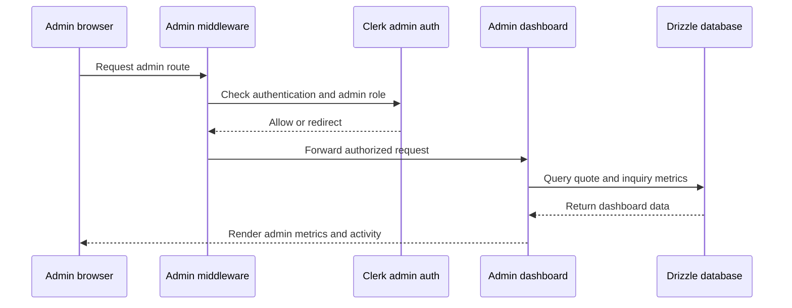

<!-- This is an auto-generated comment: summarize by coderabbit.ai -->
<!-- review_stack_entry_start -->

[](https://app.coderabbit.ai/change-stack/erfanansarioct10-oss/black-swa-v1/pull/12?utm_source=github_walkthrough&utm_medium=github&utm_campaign=change_stack)

<!-- review_stack_entry_end -->
<!-- walkthrough_start -->

<details>
<summary>📝 Walkthrough</summary>

## Walkthrough

The PR adds role-protected admin routing, a responsive admin shell, an executive dashboard, and an authenticated analytics portal. It also updates implementation guidance, project tracking, roadmap content, review records, and email sender normalization.

### Changes

**Administrative portal**

| Layer / File(s)                                                                                                                                                        | Summary                                                                                                                                                           |
| ---------------------------------------------------------------------------------------------------------------------------------------------------------------------- | ----------------------------------------------------------------------------------------------------------------------------------------------------------------- |
| **Admin authorization and route isolation** <br> `lib/admin-auth.ts`, `proxy.ts`, `app/admin/layout.tsx`, `app/admin/login/...`, `app/admin/unauthorized/page.tsx`     | Adds Clerk role checks, development bypass handling, preserved login redirects, unauthorized handling, and protected admin layout rendering.                      |
| **Responsive admin shell and navigation** <br> `constants/admin-navigation.ts`, `components/providers/admin-shell-provider.tsx`, `components/admin/admin-*.tsx`        | Adds shared navigation definitions, persisted sidebar state, mobile navigation, breadcrumbs, quick actions, notifications, and role display.                      |
| **Executive dashboard and activity metrics** <br> `app/admin/page.tsx`, `components/admin/pending-directives-alert.tsx`, `components/admin/recent-activity-stream.tsx` | Adds concurrent quote and inquiry queries, KPI cards, operational alerts, database status, and unified recent activity.                                           |
| **Analytics filtering, aggregation, and visualization** <br> `app/admin/analytics/page.tsx`, `components/admin/analytics/*`                                            | Adds date-range filters, quote and quote-item aggregation, funnel and SLA metrics, throughput cards, trend charts, category breakdowns, and budget distributions. |
| **Workflow guidance and project records** <br> `AGENTS.md`, `context/*`, `docs/feature-roadmap.md`, `lib/email.ts`                                                     | Adds database analysis requirements, implementation specifications, review records, roadmap updates, progress tracking, and sender-value normalization.           |

**Estimated code review effort:** 4 (Complex) | ~60 minutes

### Sequence Diagram(s)



**Possibly related PRs**

- [erfanansarioct10-oss/black-swa-v1#8](https://github.com/erfanansarioct10-oss/black-swa-v1/pull/8): Provides the earlier Clerk-protected admin login, dashboard, and middleware.
- [erfanansarioct10-oss/black-swa-v1#10](https://github.com/erfanansarioct10-oss/black-swa-v1/pull/10): Introduces related admin authentication, dashboard data, and quote/inquiry schema usage.
- [erfanansarioct10-oss/black-swa-v1#11](https://github.com/erfanansarioct10-oss/black-swa-v1/pull/11): Contains related admin shell, authorization, dashboard, and analytics changes.

</details>

<!-- walkthrough_end -->
<!-- pre_merge_checks_walkthrough_start -->

<details>
<summary>🚥 Pre-merge checks | ✅ 3 | ❌ 2</summary>

### ❌ Failed checks (1 warning, 1 inconclusive)

|     Check name     | Status          | Explanation                                                                                                                  | Resolution                                                                                     |
| :----------------: | :-------------- | :--------------------------------------------------------------------------------------------------------------------------- | :--------------------------------------------------------------------------------------------- |
| Docstring Coverage | ⚠️ Warning      | Docstring coverage is 28.57% which is insufficient. The required threshold is 80.00%.                                        | Write docstrings for the functions missing them to satisfy the coverage threshold.             |
|    Title check     | ❓ Inconclusive | The title identifies Phase 4C but does not describe the main administrative dashboard, analytics, and authorization changes. | Use a concise descriptive title such as "Add Phase 4C Admin Analytics and Dashboard Features". |

<details>
<summary>✅ Passed checks (3 passed)</summary>

|         Check name         | Status    | Explanation                                                              |
| :------------------------: | :-------- | :----------------------------------------------------------------------- |
|     Description Check      | ✅ Passed | Check skipped - CodeRabbit’s high-level summary is enabled.              |
|    Linked Issues check     | ✅ Passed | Check skipped because no linked issues were found for this pull request. |
| Out of Scope Changes check | ✅ Passed | Check skipped because no linked issues were found for this pull request. |

</details>

</details>

<!-- pre_merge_checks_walkthrough_end -->
<!-- finishing_touch_checkbox_start -->

<details>
<summary>✨ Finishing Touches 💡 1</summary>

<!-- finishing_touch_suggestion:docstrings -->
<details>
<summary>📝 Generate docstrings 💡</summary>

- [ ] <!-- {"checkboxId": "7962f53c-55bc-4827-bfbf-6a18da830691"} --> Create stacked PR
- [ ] <!-- {"checkboxId": "3e1879ae-f29b-4d0d-8e06-d12b7ba33d98"} --> Commit on current branch

</details>
<details>
<summary>🧪 Generate unit tests (beta)</summary>

- [ ] <!-- {"checkboxId": "f47ac10b-58cc-4372-a567-0e02b2c3d479", "radioGroupId": "utg-output-choice-group-unknown_comment_id"} -->   Create PR with unit tests
- [ ] <!-- {"checkboxId": "6ba7b810-9dad-11d1-80b4-00c04fd430c8", "radioGroupId": "utg-output-choice-group-unknown_comment_id"} -->   Commit unit tests in branch `phase4C`

</details>

</details>

<!-- finishing_touch_checkbox_end -->
<!-- tips_start -->

---

<sub>Comment `@coderabbitai help` to get the list of available commands.</sub>

<!-- tips_end -->

**Actionable comments posted: 12**

<details>
<summary>🧹 Nitpick comments (5)</summary><blockquote>

<details>
<summary>lib/admin-auth.ts (1)</summary><blockquote>

`23-52`: _🔒 Security & Privacy_ | _🔵 Trivial_

**Confirm the scope of `ADMIN_DEV_BYPASS`.**

When `isDevBypass` is `true`, the check at line 42 (`if (!isAdmin && !isDevBypass)`) skips the role check for any authenticated user, not only the synthetic anonymous dev session created at lines 27-34. Any signed-in, non-admin Clerk user gains admin access as long as `ADMIN_DEV_BYPASS=true` and `NODE_ENV !== "production"`.

This may be intentional for developer convenience, but confirm that `ADMIN_DEV_BYPASS` is never set in a shared or externally reachable non-production environment (for example, a public preview deployment), since that would grant admin access to any authenticated account, not just a deliberately impersonated one.

<details>
<summary>🤖 Prompt for AI Agents</summary>

```
Verify each finding against current code. Fix only still-valid issues, skip the
rest with a brief reason, keep changes minimal, and validate.

In `@lib/admin-auth.ts` around lines 23 - 52, Restrict ADMIN_DEV_BYPASS in
requireAdminAuth to the synthetic anonymous dev session rather than allowing it
to bypass isAdmin for authenticated users. Update the authorization condition so
signed-in non-admin users still redirect to /admin/unauthorized, while
preserving the existing dev session behavior and production guard.
```

</details>

<!-- cr-comment:v1:563a192db83681b8cd4b271e -->

</blockquote></details>
<details>
<summary>constants/admin-navigation.ts (1)</summary><blockquote>

`73-82`: _🎯 Functional Correctness_ | _🔵 Trivial_ | _⚡ Quick win_

**Use prefix-aware matching in `getAdminRouteTitle` to match `isNavItemActive`.**

`getAdminRouteTitle` only matches an exact `pathname`, while `isNavItemActive` in the same file also matches nested sub-routes via `pathname.startsWith(`${href}/`)`. Once a detail route like `/admin/quotes/123` exists, the sidebar will highlight "Quote Requests" as active, but the header breadcrumb will fall back to the generic "Admin Portal" title. Reuse `isNavItemActive` here so both stay consistent.

<details>
<summary>♻️ Proposed fix for consistent route-title matching</summary>

```diff
 export function getAdminRouteTitle(pathname: string): string {
   for (const section of ADMIN_NAV_SECTIONS) {
     for (const item of section.items) {
-      if (item.href === pathname) {
+      if (isNavItemActive(pathname, item.href)) {
         return item.title;
       }
     }
   }
   return "Admin Portal";
 }
```

</details>

<details>
<summary>🤖 Prompt for AI Agents</summary>

```
Verify each finding against current code. Fix only still-valid issues, skip the
rest with a brief reason, keep changes minimal, and validate.

In `@constants/admin-navigation.ts` around lines 73 - 82, Update
getAdminRouteTitle to reuse isNavItemActive when comparing each navigation item,
passing the current pathname and item.href so nested routes resolve to the same
title as the active sidebar item while preserving the Admin Portal fallback.
```

</details>

<!-- cr-comment:v1:4692cee2ff99e0924a8229cb -->

</blockquote></details>
<details>
<summary>components/admin/admin-header.tsx (1)</summary><blockquote>

`86-175`: _📐 Maintainability & Code Quality_ | _🔵 Trivial_ | _⚡ Quick win_

**Derive Quick Actions and notification links from the shared navigation constants.**

The Quick Actions dropdown and the notification list hardcode `href` and icon values that already exist in `constants/admin-navigation.ts` (`Quote Requests` → `/admin/quotes`, `Contact Inquiries` → `/admin/inquiries`, `System Diagnostics` → `/admin/diagnostics`). This file already imports `getAdminRouteTitle` from that module for the breadcrumb, so it depends on it as a source of truth in one place but not the other.

Duplicating the route paths here risks drift if a route is renamed or removed in `constants/admin-navigation.ts` without updating this file.

<details>
<summary>🤖 Prompt for AI Agents</summary>

```
Verify each finding against current code. Fix only still-valid issues, skip the
rest with a brief reason, keep changes minimal, and validate.

In `@components/admin/admin-header.tsx` around lines 86 - 175, Update the Quick
Actions and notification links in the admin header to derive their destinations
and icons from the shared navigation constants in admin-navigation.ts. Reuse the
existing navigation entries for Quote Requests, Contact Inquiries, and System
Diagnostics rather than hardcoding href or icon values in the DropdownMenu
sections. Keep the current labels, styling, and notification content unchanged
while ensuring both link lists use the shared source of truth.
```

</details>

<!-- cr-comment:v1:f2522da1a9fec0c3f9605ed8 -->

</blockquote></details>
<details>
<summary>components/admin/pending-directives-alert.tsx (1)</summary><blockquote>

`46-46`: _📐 Maintainability & Code Quality_ | _🔵 Trivial_

**Consider respecting reduced-motion preference for the pulsing alert icon.**

`animate-pulse` runs continuously with no `motion-reduce` guard. Users with vestibular sensitivity who set `prefers-reduced-motion: reduce` still receive the animation.

<details>
<summary>♻️ Optional fix</summary>

```diff
-          <AlertTriangle className="w-5 h-5 animate-pulse" />
+          <AlertTriangle className="w-5 h-5 motion-safe:animate-pulse" />
```

</details>

<details>
<summary>🤖 Prompt for AI Agents</summary>

```
Verify each finding against current code. Fix only still-valid issues, skip the
rest with a brief reason, keep changes minimal, and validate.

In `@components/admin/pending-directives-alert.tsx` at line 46, Update the
AlertTriangle icon’s className to disable the continuous pulse when
prefers-reduced-motion is enabled, while preserving the existing animation for
users without that preference.
```

</details>

<!-- cr-comment:v1:02390a4a747a414c5e6a0d51 -->

</blockquote></details>
<details>
<summary>app/admin/analytics/page.tsx (1)</summary><blockquote>

`70-73`: _🚀 Performance & Scalability_ | _🔵 Trivial_ | _🏗️ Heavy lift_

**Move quote/quote-item aggregation to SQL instead of loading full row sets into memory.**

`filteredQuotes` (Lines 70-73) and `filteredItems` (Lines 180-186) fetch entire rows for the whole date range with no limit, then compute counts, sums, and averages in JavaScript across the full array (Lines 88-237). For the "All Time" preset, this pulls the entire `quotes` and `quote_items` tables into Node process memory on every page load, rather than letting PostgreSQL do the aggregation via `COUNT`, `SUM`, and `GROUP BY`, which would also make better use of `idx_quotes_status` and the date columns.

Consider replacing the in-memory reduction with aggregate SQL queries (e.g. `db.select({ status: quotes.status, count: sql\`count(\*)\` }).from(quotes).where(dateFilter).groupBy(quotes.status)`) for the funnel and budget/category breakdowns.

Also applies to: 180-186

<details>
<summary>🤖 Prompt for AI Agents</summary>

```
Verify each finding against current code. Fix only still-valid issues, skip the
rest with a brief reason, keep changes minimal, and validate.

In `@app/admin/analytics/page.tsx` around lines 70 - 73, Replace the full-row
queries assigned to filteredQuotes and filteredItems with SQL aggregate queries
that calculate funnel counts, budget totals, averages, and category breakdowns
in PostgreSQL using COUNT, SUM, AVG, and GROUP BY as appropriate. Update the
downstream analytics logic in the page component to consume the aggregate
results while preserving the existing metrics and dateFilter behavior, and avoid
loading complete quote or quote-item datasets into memory.
```

</details>

<!-- cr-comment:v1:d29672429d42a1ee55f2e059 -->

</blockquote></details>

</blockquote></details>

<details>
<summary>🤖 Prompt for all review comments with AI agents</summary>

```
Verify each finding against current code. Fix only still-valid issues, skip the
rest with a brief reason, keep changes minimal, and validate.

Inline comments:
In `@app/admin/analytics/page.tsx`:
- Line 204: Update the topCat fallback in the categoryBreakdowns handling to use
the file’s neutral “N/A” category value instead of hardcoding “Medical Imaging”,
while preserving the zero count for empty data.
- Around line 27-42: Validate rangeParam against the supported PresetRange
values before the date-selection branches, or add a final fallback branch, so
unrecognized values such as "90d" use the same 30-day start date as the "30d"
case. Preserve the existing behavior for "7d", "30d", "ytd", and "all".
- Around line 206-217: Update the trend aggregation around trendMap so each
bucket includes the year in its date key, preventing identical month/day values
from different years from merging. Sort the resulting trend entries
chronologically by their underlying date before constructing trendPoints, while
preserving the existing label and count fields used by the chart.
- Around line 146-177: The SLA calculation in the analytics flow must use
per-stage timestamps instead of the overall created-to-updated duration. Add and
populate assignedAt, quotedAt, and completedAt through the quote schema and
migrations, then update the filteredQuotes loop and slaBreakdown calculations to
compute assignment, quoting, and completion durations from each corresponding
timestamp while preserving the existing minimum floors and zero-count defaults.

In `@app/admin/page.tsx`:
- Around line 42-67: Update the processedCount query in the dashboard
data-loading block to count only quotes with status "quoted" or "completed" by
replacing the broad non-pending filter with the appropriate inArray condition.
Keep completionRate and the KPI Card 3 footer backed by this corrected
processedCount so the displayed “Quoted or completed” metric remains consistent.

In `@components/admin/admin-sidebar.tsx`:
- Around line 12-22: Use the mounted flag from useAdminShell in AdminSidebar to
conditionally apply the sidebar transition classes. Keep the current width
behavior based on isCollapsed, but omit transition-all and duration-300 until
mounted is true so the persisted layout appears without an initial animation.

In `@components/admin/recent-activity-stream.tsx`:
- Around line 36-55: Update the recent-activity relative-time rendering around
formatRelativeTime and its call site to defer formatting until after client
mount via useEffect, rendering a stable placeholder or ISO value during SSR and
hydration. Preserve updates when createdAt changes, and keep formatRelativeTime
for the post-mount label.

In `@context/ai-workflow-rules.md`:
- Line 303: Update the database-task checklist in context/ai-workflow-rules.md
to include inspection of db/schema.ts and verification of Supabase PostgreSQL
RLS policies and performance indexes alongside migration review, or reference
the canonical AGENTS.md rule. Keep the workflow consistent with the project’s
source-of-truth guidance and avoid introducing conflicting instructions.

In
`@context/code-rabbits-comments/coderabbit-comment-after-last-commit-8f37cec.md`:
- Line 125: Update all eight fenced prompt blocks in the referenced generated
content to use the text language identifier, including the blocks at the
specified locations. If the file is generated, update the responsible generator
or template so the language identifiers persist on regeneration.

In `@docs/feature-roadmap.md`:
- Around line 85-90: Update the Phase 4C checklist to match Spec 29: change the
funnel stages to Submission, Under Review, Manager Assigned, Quoted, and
Completed/Closed; replace the date-filter list with 7 Days, 30 Days,
Year-to-Date, and All Time; and remove the unsupported Department and Custom
filters or define them before retaining the completed status.

In `@lib/email.ts`:
- Line 8: Update the rawFromEmail normalization to strip quotes only when the
first and last characters form a matching outer quote pair, rather than
independently removing either boundary quote. Preserve quoted display names such
as `"Black Swan International" <quotes@example.com>` unchanged.

In `@proxy.ts`:
- Around line 25-30: Update the middleware role-check condition surrounding
isAdminSession so the check is skipped only when NODE_ENV is not production and
ADMIN_DEV_BYPASS equals "true"; otherwise continue enforcing the existing
unauthorized redirect. Keep the current isAdminSession and NextResponse behavior
unchanged.

---

Nitpick comments:
In `@app/admin/analytics/page.tsx`:
- Around line 70-73: Replace the full-row queries assigned to filteredQuotes and
filteredItems with SQL aggregate queries that calculate funnel counts, budget
totals, averages, and category breakdowns in PostgreSQL using COUNT, SUM, AVG,
and GROUP BY as appropriate. Update the downstream analytics logic in the page
component to consume the aggregate results while preserving the existing metrics
and dateFilter behavior, and avoid loading complete quote or quote-item datasets
into memory.

In `@components/admin/admin-header.tsx`:
- Around line 86-175: Update the Quick Actions and notification links in the
admin header to derive their destinations and icons from the shared navigation
constants in admin-navigation.ts. Reuse the existing navigation entries for
Quote Requests, Contact Inquiries, and System Diagnostics rather than hardcoding
href or icon values in the DropdownMenu sections. Keep the current labels,
styling, and notification content unchanged while ensuring both link lists use
the shared source of truth.

In `@components/admin/pending-directives-alert.tsx`:
- Line 46: Update the AlertTriangle icon’s className to disable the continuous
pulse when prefers-reduced-motion is enabled, while preserving the existing
animation for users without that preference.

In `@constants/admin-navigation.ts`:
- Around line 73-82: Update getAdminRouteTitle to reuse isNavItemActive when
comparing each navigation item, passing the current pathname and item.href so
nested routes resolve to the same title as the active sidebar item while
preserving the Admin Portal fallback.

In `@lib/admin-auth.ts`:
- Around line 23-52: Restrict ADMIN_DEV_BYPASS in requireAdminAuth to the
synthetic anonymous dev session rather than allowing it to bypass isAdmin for
authenticated users. Update the authorization condition so signed-in non-admin
users still redirect to /admin/unauthorized, while preserving the existing dev
session behavior and production guard.
```

</details>

<details>
<summary>🪄 Autofix (Beta)</summary>

Fix all unresolved CodeRabbit comments on this PR:

- [ ] <!-- {"checkboxId": "4b0d0e0a-96d7-4f10-b296-3a18ea78f0b9"} --> Push a commit to this branch (recommended)
- [ ] <!-- {"checkboxId": "ff5b1114-7d8c-49e6-8ac1-43f82af23a33"} --> Create a new PR with the fixes

</details>

---

<details>
<summary>ℹ️ Review info</summary>

<details>
<summary>⚙️ Run configuration</summary>

**Configuration used**: defaults

**Review profile**: CHILL

**Plan**: Pro Plus

**Run ID**: `6a1d23ae-10ba-4d95-9711-da12e0e9ad02`

</details>

<details>
<summary>📥 Commits</summary>

Reviewing files that changed from the base of the PR and between 9609e76a150fd574ee9d1d65d323207260eed659 and 7ed10c2a6f6aee7d09dc7fca2891d7124c8270f5.

</details>

<details>
<summary>📒 Files selected for processing (30)</summary>

- `AGENTS.md`
- `app/admin/analytics/page.tsx`
- `app/admin/layout.tsx`
- `app/admin/login/[[...login]]/page.tsx`
- `app/admin/page.tsx`
- `app/admin/unauthorized/page.tsx`
- `components/admin/admin-header.tsx`
- `components/admin/admin-mobile-nav.tsx`
- `components/admin/admin-sidebar.tsx`
- `components/admin/analytics/analytics-charts.tsx`
- `components/admin/analytics/analytics-filter-bar.tsx`
- `components/admin/analytics/conversion-funnel-sla.tsx`
- `components/admin/analytics/executive-throughput-cards.tsx`
- `components/admin/pending-directives-alert.tsx`
- `components/admin/recent-activity-stream.tsx`
- `components/providers/admin-shell-provider.tsx`
- `constants/admin-navigation.ts`
- `context/ai-workflow-rules.md`
- `context/code-rabbits-comments/coderabbit-comment-after-last-commit-8f37cec.md`
- `context/implementation-specs/26-phase-4a-responsive-admin-layout-and-shell.md`
- `context/implementation-specs/27-phase-4a-clerk-role-authorization-guard.md`
- `context/implementation-specs/28-phase-4b-executive-metrics-and-activity-overview.md`
- `context/implementation-specs/29-phase-4c-advanced-analytics-and-visualizations.md`
- `context/implementation-specs/30-fix-coderabbit-pr-review-findings.md`
- `context/implementation-specs/README.md`
- `context/progress-tracker.md`
- `docs/feature-roadmap.md`
- `lib/admin-auth.ts`
- `lib/email.ts`
- `proxy.ts`

</details>

</details>

<!-- This is an auto-generated comment by CodeRabbit for review status -->
