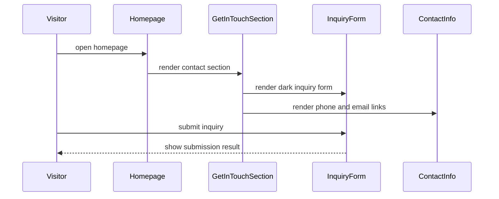

<!-- This is an auto-generated comment: summarize by coderabbit.ai -->
<!-- review_stack_entry_start -->

[](https://app.coderabbit.ai/change-stack/erfanansarioct10-oss/black-swa-v1/pull/3?utm_source=github_walkthrough&utm_medium=github&utm_campaign=change_stack)

<!-- review_stack_entry_end -->
<!-- walkthrough_start -->

<details>
<summary>📝 Walkthrough</summary>

## Walkthrough

The homepage adds Who We Are and Get in Touch sections, extracts a reusable inquiry form, updates section styling and ordering, changes image paths and assets, and refreshes contact, navigation, metadata, procurement, and CTA presentation.

### Changes

**Homepage content and inquiry flow**

| Layer / File(s)                                                                                                                                                                            | Summary                                                                                                                                                                                           |
| ------------------------------------------------------------------------------------------------------------------------------------------------------------------------------------------ | ------------------------------------------------------------------------------------------------------------------------------------------------------------------------------------------------- |
| **Shared inquiry form** <br> `components/contact/*`, `components/sections/get-in-touch-section.tsx`                                                                                        | The inquiry form is extracted into a reusable light/dark component with controlled fields, submission states, validation, and error handling, then embedded in contact and homepage layouts.      |
| **Homepage composition** <br> `app/(public)/page.tsx`, `components/sections/who-we-are-section.tsx`, `context/implementation-specs/*`, `public/about/ceo.webp`                             | The homepage adds the Who We Are section, reorders existing sections, and includes the CEO WebP asset and implementation specification.                                                           |
| **Asset and metadata paths** <br> `app/(public)/contact/page.tsx`, `app/(public)/page.tsx`, `components/layout/*`, `constants/*`, `public/hero/*`, `public/logo/*`, `public/procurement/*` | Logo and hero references move to nested asset paths, hero and logo preloads are added, procurement image constants point to new WebP assets, and the hero asset is replaced.                      |
| **Visual theme and interaction refresh** <br> `components/sections/*`, `components/ui/button.tsx`                                                                                          | Brand marquee, reviews, enterprise advantage, featured products, procurement workflow, and CTA controls receive updated colors, layout wrappers, hover states, transitions, and carousel styling. |

**Estimated code review effort:** 4 (Complex) | ~45 minutes

### Sequence Diagram(s)



**Possibly related PRs**

- [erfanansarioct10-oss/black-swa-v1#2](https://github.com/erfanansarioct10-oss/black-swa-v1/pull/2): Updates the same featured-products CTA and “Add to Quote” styling.

</details>

<!-- walkthrough_end -->
<!-- pre_merge_checks_walkthrough_start -->

<details>
<summary>🚥 Pre-merge checks | ✅ 4 | ❌ 1</summary>

### ❌ Failed checks (1 warning)

|     Check name     | Status     | Explanation                                                                          | Resolution                                                                         |
| :----------------: | :--------- | :----------------------------------------------------------------------------------- | :--------------------------------------------------------------------------------- |
| Docstring Coverage | ⚠️ Warning | Docstring coverage is 0.00% which is insufficient. The required threshold is 80.00%. | Write docstrings for the functions missing them to satisfy the coverage threshold. |

<details>
<summary>✅ Passed checks (4 passed)</summary>

|         Check name         | Status    | Explanation                                                                             |
| :------------------------: | :-------- | :-------------------------------------------------------------------------------------- |
|     Description Check      | ✅ Passed | Check skipped - CodeRabbit’s high-level summary is enabled.                             |
|        Title check         | ✅ Passed | The title clearly summarizes the main homepage additions and matches the PR objectives. |
|    Linked Issues check     | ✅ Passed | Check skipped because no linked issues were found for this pull request.                |
| Out of Scope Changes check | ✅ Passed | Check skipped because no linked issues were found for this pull request.                |

</details>

</details>

<!-- pre_merge_checks_walkthrough_end -->
<!-- finishing_touch_checkbox_start -->

<details>
<summary>✨ Finishing Touches 💡 1</summary>

<!-- finishing_touch_suggestion:docstrings -->
<details>
<summary>📝 Generate docstrings 💡</summary>

- [ ] <!-- {"checkboxId": "7962f53c-55bc-4827-bfbf-6a18da830691"} --> Create stacked PR
- [ ] <!-- {"checkboxId": "3e1879ae-f29b-4d0d-8e06-d12b7ba33d98"} --> Commit on current branch

</details>
<details>
<summary>🧪 Generate unit tests (beta)</summary>

- [ ] <!-- {"checkboxId": "f47ac10b-58cc-4372-a567-0e02b2c3d479", "radioGroupId": "utg-output-choice-group-unknown_comment_id"} -->   Create PR with unit tests
- [ ] <!-- {"checkboxId": "6ba7b810-9dad-11d1-80b4-00c04fd430c8", "radioGroupId": "utg-output-choice-group-unknown_comment_id"} -->   Commit unit tests in branch `about-us`

</details>

</details>

<!-- finishing_touch_checkbox_end -->
<!-- tips_start -->

---

<sub>Comment `@coderabbitai help` to get the list of available commands.</sub>

<!-- tips_end -->

**Actionable comments posted: 4**

<details>
<summary>🧹 Nitpick comments (2)</summary><blockquote>

<details>
<summary>components/sections/get-in-touch-section.tsx (1)</summary><blockquote>

`60-70`: _🔒 Security & Privacy_ | _🔵 Trivial_ | _⚡ Quick win_

**Sandbox the third-party map frame.**

The fixed Google source cannot read this page because of the same-origin policy, but an unsandboxed frame can still request top-level navigation or popups after user interaction. Add a minimal sandbox allowlist and verify map interactions still work.

<details>
<summary>Proposed hardening</summary>

```diff
 <iframe
+  sandbox="allow-scripts allow-same-origin"
   src="https://maps.google.com/maps?q=27.688477,85.344228&z=15&output=embed"
```

</details>

<details>
<summary>🤖 Prompt for AI Agents</summary>

```
Verify each finding against current code. Fix only still-valid issues, skip the
rest with a brief reason, keep changes minimal, and validate.

In `@components/sections/get-in-touch-section.tsx` around lines 60 - 70, Add a
minimal sandbox policy to the Google Maps iframe in the get-in-touch section,
allowing only the capabilities required for map interactions while preventing
top-level navigation and popups. Preserve the existing source and iframe
behavior, and verify the embedded map remains usable under the new sandbox
restrictions.
```

</details>

<!-- cr-comment:v1:74482f14114ca74293b53142 -->

_Source: Linters/SAST tools_

</blockquote></details>
<details>
<summary>app/(public)/page.tsx (1)</summary><blockquote>

`15-15`: _🚀 Performance & Scalability_ | _🔵 Trivial_ | _⚡ Quick win_

**Do not high-priority preload below-the-fold marquee logos.**

These six `high` priority requests compete with the hero LCP image, while `BrandMarquee` appears after the new Who We Are section. Let the marquee load normally; retain the hero preload.

<details>
<summary>Proposed change</summary>

```diff
-import { BRAND_LOGOS_ROW_1 } from "`@/constants/brands`";
...
-  BRAND_LOGOS_ROW_1.slice(0, 6).forEach((brand) => {
-    preload(brand.imageSrc, { as: "image", type: "image/webp", fetchPriority: "high" });
-  });
```

</details>

Also applies to: 31-33

<details>
<summary>🤖 Prompt for AI Agents</summary>

```
Verify each finding against current code. Fix only still-valid issues, skip the
rest with a brief reason, keep changes minimal, and validate.

In `@app/`(public)/page.tsx at line 15, Remove the below-the-fold
BRAND_LOGOS_ROW_1 import and its associated high-priority marquee logo loading
in the page component, while retaining the hero image preload. Ensure
BrandMarquee logos load normally without high-priority/preload behavior.
```

</details>

<!-- cr-comment:v1:f4e40b01defe380358347c39 -->

</blockquote></details>

</blockquote></details>

<details>
<summary>🤖 Prompt for all review comments with AI agents</summary>

```
Verify each finding against current code. Fix only still-valid issues, skip the
rest with a brief reason, keep changes minimal, and validate.

Inline comments:
In `@components/contact/inquiry-form.tsx`:
- Around line 22-38: Replace the useSimulatedFormSubmit integration in the
inquiry form with the real server action or API submission, passing the
collected formData fields and awaiting its result before marking the inquiry
submitted. Set the form’s success state only when persistence succeeds, and
populate errorMessage when the request fails; apply this behavior consistently
to both /contact and homepage inquiry forms.

In `@components/sections/brand-marquee.tsx`:
- Around line 45-47: Update the two edge-gradient mask divs in the brand marquee
to use z-20 instead of z-10, ensuring they render above the header and track
wrappers while preserving their existing positioning and gradient styling.

In `@components/sections/popular-services-section.tsx`:
- Around line 127-130: Scope the CTA arrow animation to the link itself by
changing the CTA’s class from group to group/link and updating the ArrowRight
class to use group-hover/link:translate-x-0.5. Leave the card’s outer group
behavior unchanged.

In `@context/implementation-specs/12-homepage-who-we-are-section.md`:
- Around line 12-14: Update the Who We Are specification’s CEO asset references
from public/ceo.webp and /ceo.webp to the committed public/about/ceo.webp and
consumed /about/ceo.webp paths, including the implementation sample and data
table. Keep all other section details unchanged.

---

Nitpick comments:
In `@app/`(public)/page.tsx:
- Line 15: Remove the below-the-fold BRAND_LOGOS_ROW_1 import and its associated
high-priority marquee logo loading in the page component, while retaining the
hero image preload. Ensure BrandMarquee logos load normally without
high-priority/preload behavior.

In `@components/sections/get-in-touch-section.tsx`:
- Around line 60-70: Add a minimal sandbox policy to the Google Maps iframe in
the get-in-touch section, allowing only the capabilities required for map
interactions while preventing top-level navigation and popups. Preserve the
existing source and iframe behavior, and verify the embedded map remains usable
under the new sandbox restrictions.
```

</details>

<details>
<summary>🪄 Autofix (Beta)</summary>

Fix all unresolved CodeRabbit comments on this PR:

- [ ] <!-- {"checkboxId": "4b0d0e0a-96d7-4f10-b296-3a18ea78f0b9"} --> Push a commit to this branch (recommended)
- [ ] <!-- {"checkboxId": "ff5b1114-7d8c-49e6-8ac1-43f82af23a33"} --> Create a new PR with the fixes

</details>

---

<details>
<summary>ℹ️ Review info</summary>

<details>
<summary>⚙️ Run configuration</summary>

**Configuration used**: defaults

**Review profile**: CHILL

**Plan**: Pro Plus

**Run ID**: `8ab04808-b41b-4c82-82b2-930f135140d4`

</details>

<details>
<summary>📥 Commits</summary>

Reviewing files that changed from the base of the PR and between abb631bd284bbf5b151e5a55ddca8199faf659e0 and ce067e35eb0ba5e5d79fbb215b5e3da42eb097ff.

</details>

<details>
<summary>📒 Files selected for processing (27)</summary>

- `app/(public)/contact/page.tsx`
- `app/(public)/page.tsx`
- `components/contact/contact-form.tsx`
- `components/contact/inquiry-form.tsx`
- `components/layout/main-header.tsx`
- `components/layout/mobile-nav.tsx`
- `components/layout/public-footer.tsx`
- `components/sections/brand-marquee.tsx`
- `components/sections/customer-reviews-section.tsx`
- `components/sections/enterprise-advantage-section.tsx`
- `components/sections/featured-products-section.tsx`
- `components/sections/get-in-touch-section.tsx`
- `components/sections/popular-services-section.tsx`
- `components/sections/procurement-workflow-section.tsx`
- `components/sections/who-we-are-section.tsx`
- `components/ui/button.tsx`
- `constants/procurement-workflow.ts`
- `constants/site.ts`
- `context/implementation-specs/12-homepage-who-we-are-section.md`
- `context/progress-tracker.md`
- `public/about/ceo.webp`
- `public/hero/hero.webp`
- `public/logo/logo.webp`
- `public/procurement/burn-in.webp`
- `public/procurement/custom-spec.webp`
- `public/procurement/sla-mapping.webp`
- `public/procurement/sla-support.webp`

</details>

</details>

<!-- This is an auto-generated comment by CodeRabbit for review status -->
