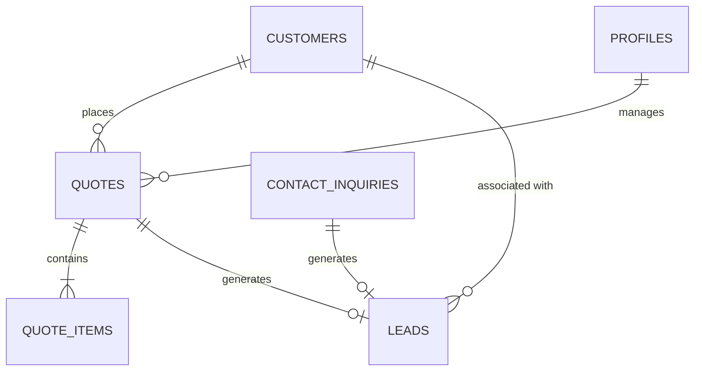

# Database Schema

> This document defines the complete active database design, table structures, column definitions, index strategy, and Row-Level Security (RLS) policies for the Black Swan International platform.

---

# Architecture & Provider

- **Database Engine**: Supabase PostgreSQL
- **ORM & Migrations**: Drizzle ORM (`drizzle-orm/pg-core`)
- **Primary Keys**: UUID (`uuid_generate_v4()` / `defaultRandom()`)
- **Timestamps**: UTC with Timezone (`timestamp("...", { withTimezone: true })`)
- **Access Control**: Supabase Row-Level Security (RLS) policies enabled per table with Clerk server-side context guards

---

# Core Principles

1. **Strict Type Safety**: All table schemas defined natively in `db/schema.ts` using Drizzle ORM primitives.
2. **PostgreSQL RLS**: Row-Level Security policies active on production tables to protect public and administrative data.
3. **Optimized Indexing**: Expression indexes (`lower(email)`, `upper(reference_id)`) and foreign key indexes for rapid query resolution.
4. **Relational Integrity**: Foreign keys configured with cascading or nullifying delete handlers (`onDelete: "cascade"`, `onDelete: "set null"`).

---

# Active Production Tables

## 1. `profiles`

**Purpose**: Stores user profile synchronization data linked to Clerk authentication sessions.

**Fields**:
- `id` (`uuid`, Primary Key, `defaultRandom()`)
- `clerk_user_id` (`text`, Unique, Not Null) — Foreign identifier mapping to Clerk User ID
- `email` (`text`, Not Null)
- `full_name` (`text`)
- `created_at` (`timestamp with timezone`, Not Null, `defaultNow()`)
- `updated_at` (`timestamp with timezone`, Not Null, `defaultNow()`)

---

## 2. `customers`

**Purpose**: Central Customer & Account Management entity (Phase 5A Core) tracking enterprise clients, hospitals, clinics, and media studios.

**Fields**:
- `id` (`uuid`, Primary Key, `defaultRandom()`)
- `organization_name` (`text`, Not Null) — Name of the hospital, studio, or enterprise
- `organization_type` (`text`, Enum, Default: `'enterprise'`) — `['hospital', 'clinic', 'broadcast_studio', 'media_network', 'enterprise']`
- `primary_contact_name` (`text`, Not Null)
- `primary_contact_email` (`text`, Not Null)
- `primary_contact_phone` (`text`)
- `address` (`text`)
- `city` (`text`)
- `state` (`text`)
- `postal_code` (`text`)
- `country` (`text`, Default: `'Nepal'`)
- `tax_registration_id` (`text`) — PAN / VAT registration number
- `lead_source` (`text`, Enum, Default: `'website_rfq'`) — `['website_rfq', 'direct_inquiry', 'referral', 'trade_show', 'outreach']`
- `status` (`text`, Enum, Default: `'lead'`) — `['active', 'lead', 'prospect', 'archived']`
- `notes` (`text`) — Internal account director notes
- `created_at` (`timestamp with timezone`, Not Null, `defaultNow()`)
- `updated_at` (`timestamp with timezone`, Not Null, `defaultNow()`)

**Indexes**:
- `idx_customers_email`: `lower(primary_contact_email)`
- `idx_customers_org_name`: `lower(organization_name)`
- `idx_customers_status`: `status`
- `idx_customers_org_type`: `organization_type`

---

## 3. `quotes`

**Purpose**: Quotation Request headers generated from public hardware RFQ submissions or admin creation.

**Fields**:
- `id` (`uuid`, Primary Key, `defaultRandom()`)
- `reference_id` (`text`, Unique, Not Null) — Public formatted reference (e.g., `BSI-RFQ-8X2K9P`)
- `lookup_token` (`text`, Unique, Not Null) — High-entropy security token for anonymous status lookup
- `clerk_user_id` (`text`) — Optional authenticated user ID
- `customer_id` (`uuid`, FK -> `customers.id`, `onDelete: "set null"`) — Associated CRM customer record
- `full_name` (`text`, Not Null)
- `email` (`text`, Not Null)
- `phone` (`text`, Not Null)
- `company_name` (`text`)
- `project_scope` (`text`) — Project technical requirements summary
- `budget_range` (`text`) — Estimated NPR budget range
- `timeline` (`text`) — Target implementation timeframe
- `status` (`text`, Enum, Default: `'pending'`) — `['pending', 'under_review', 'manager_assigned', 'quoted', 'completed', 'rejected']`
- `assigned_manager_id` (`text`) — Managing Director or Sales Executive Clerk ID
- `admin_notes` (`text`) — Confidential internal review notes
- `assigned_at` (`timestamp with timezone`)
- `quoted_at` (`timestamp with timezone`)
- `completed_at` (`timestamp with timezone`)
- `created_at` (`timestamp with timezone`, Not Null, `defaultNow()`)
- `updated_at` (`timestamp with timezone`, Not Null, `defaultNow()`)

**Indexes**:
- `idx_quotes_clerk_user_id`: `clerk_user_id`
- `idx_quotes_customer_id`: `customer_id`
- `idx_quotes_status`: `status`
- `idx_quotes_upper_reference_id`: `upper(reference_id)`
- `idx_quotes_lower_email`: `lower(email)`

---

## 4. `quote_items`

**Purpose**: Individual hardware line-items associated with a quotation request.

**Fields**:
- `id` (`uuid`, Primary Key, `defaultRandom()`)
- `quote_id` (`uuid`, FK -> `quotes.id`, `onDelete: "cascade"`, Not Null)
- `product_id` (`text`, Not Null) — Product slug or SKU
- `product_title` (`text`, Not Null)
- `category` (`text`, Not Null) — Category tag (e.g., Medical Imaging, Broadcast IT)
- `quantity` (`integer`, Not Null, Default: `1`)
- `notes` (`text`) — Technical specs or customization requirements per line item
- `created_at` (`timestamp with timezone`, Not Null, `defaultNow()`)

**Indexes**:
- `idx_quote_items_quote_id`: `quote_id`

---

## 5. `contact_inquiries`

**Purpose**: General contact form submissions and service inquiries from the public website.

**Fields**:
- `id` (`uuid`, Primary Key, `defaultRandom()`)
- `full_name` (`text`, Not Null)
- `company_name` (`text`, Not Null)
- `email` (`text`, Not Null)
- `phone` (`text`)
- `service_slug` (`text`) — Target service (e.g., Medical Telehealth Infrastructure)
- `message` (`text`, Not Null)
- `status` (`text`, Enum, Default: `'new'`) — `['new', 'in_progress', 'resolved', 'archived']`
- `created_at` (`timestamp with timezone`, Not Null, `defaultNow()`)
- `updated_at` (`timestamp with timezone`, Not Null, `defaultNow()`)

**Indexes**:
- `idx_contact_inquiries_email`: `email`
- `idx_contact_inquiries_status`: `status`

---

## 6. `leads`

**Purpose**: Inbound CRM Pipeline Engine (Phase 5B Core) tracking sales leads converted from RFQs or direct inquiries.

**Fields**:
- `id` (`uuid`, Primary Key, `defaultRandom()`)
- `title` (`text`, Not Null) — Lead title or inquiry description
- `contact_name` (`text`, Not Null)
- `email` (`text`, Not Null)
- `phone` (`text`)
- `company_name` (`text`)
- `lead_source` (`text`, Enum, Default: `'website_rfq'`) — `['website_rfq', 'direct_inquiry', 'referral', 'trade_show', 'outreach']`
- `status` (`text`, Enum, Default: `'new'`) — `['new', 'contacted', 'qualified', 'unqualified', 'converted']`
- `priority` (`text`, Enum, Default: `'medium'`) — `['low', 'medium', 'high', 'urgent']`
- `estimated_value` (`integer`, Default: `0`) — Estimated deal value in NPR
- `assigned_manager_id` (`text`) — Account Director or Sales Manager Clerk ID
- `notes` (`text`) — Activity logs and qualification notes
- `customer_id` (`uuid`, FK -> `customers.id`, `onDelete: "set null"`)
- `quote_id` (`uuid`, FK -> `quotes.id`, `onDelete: "set null"`)
- `inquiry_id` (`uuid`, FK -> `contact_inquiries.id`, `onDelete: "set null"`)
- `created_at` (`timestamp with timezone`, Not Null, `defaultNow()`)
- `updated_at` (`timestamp with timezone`, Not Null, `defaultNow()`)

**Indexes**:
- `idx_leads_email`: `lower(email)`
- `idx_leads_status`: `status`
- `idx_leads_priority`: `priority`
- `idx_leads_source`: `lead_source`
- `idx_leads_customer_id`: `customer_id`

---

# Entity Relationship Diagram

---

# Row-Level Security (RLS) Policies

All tables have Supabase Row-Level Security enabled. Service Role Key and Server Actions operate with elevated privileges, while public client access is restricted:

- **`quotes` / `quote_items`**: Public insertions allowed for new RFQ submissions; select allowed for lookup token match; full CRUD restricted to authenticated admin users (`service_role`).
- **`customers`**: Administrative access only (`service_role` / Clerk `admin` session).
- **`leads`**: Administrative access only (`service_role` / Clerk `admin` session).
- **`contact_inquiries`**: Public insert allowed for contact form; admin read/update restricted to service role.

---

# Migration Workflow Rules

1. **Schema Modifications**: Modify Drizzle table definitions in `db/schema.ts`.
2. **Generate Migration SQL**: Execute `pnpm exec supabase migration new <migration_name>` or `pnpm exec drizzle-kit generate`.
3. **Verification**: Run `pnpm db:push` or local Supabase migration commands (`pnpm exec supabase db push`) to verify constraints, indexes, and RLS policies.
4. **Documentation Sync**: Update this document (`docs/database-schema.md`) whenever tables, columns, or enums are created or altered.

